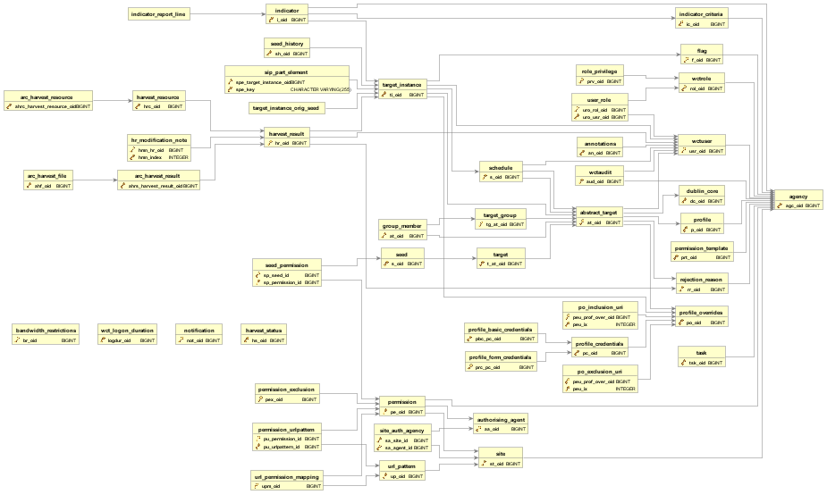

===============
Data Dictionary
===============

Additional TODO
===============

-   Do a git comparison between version 1.6.2 and version 2.0.0 and document
    all changes between the two versions.

Introduction
============

This guide, designed for a Web Curator Tool developer and contributor, explains
and documents the database for the Web Curator Tool. The source for both code
and documentation for the Web Curator Tool can be found at:
http://dia-nz.github.io/webcurator/

For information on how to install and setup the Web Curator Tool, see the Web
Curator Tool System Administrator Guide. For information about developing
and contributing to the Web Curator Tool, see the Developer Guide. For
information on using the Web Curator Tool, see the Web Curator Tool Quick Start
Guide and the Web Curator Tool online help.

Contents of this document
-------------------------

Following this introduction, the Web Curator Tool Developer Guide includes the
following sections:

-   **Changes** - Covers changes between different versioned releases.

-   **Data model diagram** - provides a diagram of the WCT data model.

-   **Data descriptions** - Data descriptions for the data fields.

-   **Database descriptions** - Descriptions for the tables and their fields.

-   **Generating primary keys** - How to generate primary keys.

Changes
=======

Changes since 2.0.0
-------------------

-   Placeholder for changes since version 2.0.0. This list should be updated
    after every feature/bug fix is merged into the master branch.

1.6.2 to 2.0.0
--------------

-   Placeholder for changes between version 1.6.2 and 2.0.0.

Data model diagram
==================

The data model diagram shows the relationships between the different tables.

Note that this diagram cannot be updated since we don't have the original
source file. Any significant updates to the tables and/or their relationships
should result in the commissioning of a new diagram.

|diagramDataModel|

Data descriptions
=================

Overview
--------

This section describes the tables in the WCT database.

Field types
-----------

Field types in this document are indicative only, and may depend on the
implementation.

The types used are:

Boolean
    A Boolean value (true or false, or 0 or 1, depending on implementation). 

Text
    A free text field. 

Constrained text
    A text field whose contents are constrained to a limited set of values by
    the application (see `Constrained text fields`_ below). 

Timestamp
    A timestamp encoding a date and time. 

Primary key
    A unique internal identifier (see `Generating primary keys`_). 

Secondary key
    A key from another table. 

Float
    A floating-point number. 

Number
    An integer number. 

Constrained text fields
-----------------------

Some tables have fields that are constrained to a fixed set of values.

These fields will be implemented in the database as Text fields, but will appear
to users as enumerations (usually in a drop-down menu).

In most cases, the set of possible values can be set in a configuration file (to
support different requirements at different institutions).

In each case, a single value can be assigned.

Database descriptions
=====================

Targets, Groups and Schedules
-----------------------------

`ABSTRACT_TARGET`
~~~~~~~~~~~~~~~~~
The `ABSTRACT_TARGET` table is used to store information that is common to both
Targets and Groups.  

The table is needed because the WCT can be instructed to “harvest” an entire
Group at once, as though it were a Target. This means that the `ABSTRACT_TARGET`
is used to contain or manage all profile and scheduling information.

+-------------------------+-------------+------------------------------------------------------------------------------+
| Name                    | Type        | Description                                                                  |
+=========================+=============+==============================================================================+
| `AT_OID`                | Primary key |                                                                              |
+-------------------------+-------------+------------------------------------------------------------------------------+
| `AT_DESC`               | Text        | An internal description of the Target or Group.                              |
+-------------------------+-------------+------------------------------------------------------------------------------+
| `AT_NAME`               | Text        | The name of the Target or Group.                                             |
+-------------------------+-------------+------------------------------------------------------------------------------+
| `AT_OWNER_ID`           | Foreign key | The owner of the Target or Group.                                            |
+-------------------------+-------------+------------------------------------------------------------------------------+
| `AT_PROF_OVERRIDE_OID`  | Foreign key | The key of the profile override information for this Target or Group.        |
+-------------------------+-------------+------------------------------------------------------------------------------+
| `AT_STATE`              | Integer     | The state of the Target or Group. Values will be different for Targets than  |
|                         |             | for Groups.                                                                  |
|                         |             |                                                                              |
|                         |             | Target values correspond to: Pending, Nominated, Rejected, Approved,         |
|                         |             | Completed, Cancelled, Reinstated.                                            |
+-------------------------+-------------+------------------------------------------------------------------------------+
| `AT_PROFILE_ID`         | Foreign key | Reference to the profile information for this Target.                        |
+-------------------------+-------------+------------------------------------------------------------------------------+
| `AT_OBJECT_TYPE`        | Integer     | Identifies whether this is a Target (1) or a Group (0).                      |
+-------------------------+-------------+------------------------------------------------------------------------------+
| `AT_CREATION_DATE`      | Timestamp   | The date and time the `ABSTRACT_TARGET` was created.                         |
+-------------------------+-------------+------------------------------------------------------------------------------+
| `AT_REFERENCE`          | Text        | An external reference number (e.g. catalogue number).                        |
+-------------------------+-------------+------------------------------------------------------------------------------+
| `AT_PROFILE_NOTE`       | Text        | Records notable aspects of the site that relate to the choice of harvest     |
|                         |             | profile and overrides.                                                       |
+-------------------------+-------------+------------------------------------------------------------------------------+
| `AT_DUBLIN_CORE_OID`    | Foreign key | Reference to the Dublin Core metadata for this Target.                       |
+-------------------------+-------------+------------------------------------------------------------------------------+
| `AT_ACCESS_ZONE`        | Integer     | Access Zone (enumerated field): 0 – Public (default), 1 – On Site,           |
|                         |             | 2 - Restricted.                                                              |
+-------------------------+-------------+------------------------------------------------------------------------------+
| `AT_DISPLAY_TARGET`     | Boolean     | Display this Target.                                                         |
+-------------------------+-------------+------------------------------------------------------------------------------+
| `AT_DISPLAY_NOTE`       | Text        | Records an explanation of the Access Zone and Display Target choices.        |
+-------------------------+-------------+------------------------------------------------------------------------------+
| `AT_DISPLAY_CHG_REASON` | Text        | Records the reason the `AT_DISPLAY_TARGET` Boolean was last changed.         |
+-------------------------+-------------+------------------------------------------------------------------------------+
| `AT_RR_OID`             | Foreign key | Reference to the rejection reason for this Target.                           |
+-------------------------+-------------+------------------------------------------------------------------------------+

`TARGET`
~~~~~~~~
`TARGET` contains information specific to Target objects.

Each Target is based on an `ABSTRACT_TARGET`, and takes its primary key from the
`ABSTRACT_TARGET` primary key.

+-------------------------+-------------+------------------------------------------------------------------------------+
| Name                    | Type        | Description                                                                  |
+=========================+=============+==============================================================================+
| `T_AT_OID`          | Primary key     | Reference to `ABSTRACT_TARGET` corresponding to the Target.                  |
|                     | (Foreign key)   |                                                                              |
+---------------------+-----------------+------------------------------------------------------------------------------+
| `T_RUN_ON_APPROVAL` | Boolean         | If true, then an additional Target Instance will be scheduled to begin one   |
|                     |                 | minute after the Target state is set to Approved.                            |
+---------------------+-----------------+------------------------------------------------------------------------------+
| `T_EVALUATION_NOTE` | Text            | Records notable aspects of the site that relate to its evaluation.           |
+---------------------+-----------------+------------------------------------------------------------------------------+
| `T_SELECTION_DATE`  | Timestamp       | The date the Target was formally selected. This should be set automatically  |
|                     |                 | to the date and time the Target state first changed to Approved.             |
+---------------------+-----------------+------------------------------------------------------------------------------+
| `T_SELECTION_NOTE`  | Text            | Records information relating to the selection process, in particular         |
|                     |                 | reasons for the selection decision.                                          |
+---------------------+-----------------+------------------------------------------------------------------------------+
| `T_SELECTION_TYPE`  | Constrained     | Records the type of schedule that has been applied to the site.              |
|                     | text            | Example values: one-off, ad hoc, regular.                                    |
+---------------------+-----------------+------------------------------------------------------------------------------+
| `T_HARVEST_TYPE`    | Constrained     | Records type of selective harvest approach has been applied to the site.     |
|                     |                 | Example values: subject, event, theme.                                       |
+---------------------+-----------------+------------------------------------------------------------------------------+
| `T_USE_AQA`         | Boolean         | Records whether TIs derived from this Target should be marked for inclusion  |
|                     |                 | in the automated quality assurance (AQA) post harvest processes.             |
+---------------------+-----------------+------------------------------------------------------------------------------+
| `T_ALLOW_OPTIMIZE`  | Boolean         | Flag to indicate whether harvest optimization is permitted for this target’s |
|                     |                 | harvests.                                                                    |
+---------------------+-----------------+------------------------------------------------------------------------------+

`SEED`
~~~~~~
`SEED` contains the set of seed URLs corresponding to a Target.

+-------------------------+-------------+------------------------------------------------------------------------------+
| Name                    | Type        | Description                                                                  |
+=========================+=============+==============================================================================+
| `S_OID`                 | Primary key |                                                                              |
+-------------------------+-------------+------------------------------------------------------------------------------+
| `S_SEED`                | URL         | The seed URL.                                                                |
+-------------------------+-------------+------------------------------------------------------------------------------+
| `S_TARGET_ID`           | Foreign Key | The key of the Target the key belongs to.                                    |
+-------------------------+-------------+------------------------------------------------------------------------------+
| `S_PRIMARY`             | Boolean     | Records whether the URL is marked as a primary URL in the user interface.    |
+-------------------------+-------------+------------------------------------------------------------------------------+

`SEED_HISTORY`
~~~~~~~~~~~~~~
`SEED_HISTORY` contains the set of seed URLs corresponding to a Target Instance
when harvested. Population of this table can be turned off in `wct_core.xml`.
Once written the content is not used again by WCT.

+-------------------------+-------------+------------------------------------------------------------------------------+
| Name                    | Type        | Description                                                                  |
+=========================+=============+==============================================================================+
| `SH_OID`                | Primary key |                                                                              |
+-------------------------+-------------+------------------------------------------------------------------------------+
| `SH_TI_OID`             | Foreign Key | The key of the Target Instance the key belongs to.                           |
+-------------------------+-------------+------------------------------------------------------------------------------+
| `SH_SEED`               | URL         | The seed URL.                                                                |
+-------------------------+-------------+------------------------------------------------------------------------------+
| `SH_PRIMARY`            | Boolean     | Records whether the URL is marked as a primary URL in the user interface.    |
+-------------------------+-------------+------------------------------------------------------------------------------+

`TARGET_GROUP`
~~~~~~~~~~~~~~
`TARGET_GROUP` contains information specific to Group objects.

Each Group is based on an `ABSTRACT_TARGET`, and takes its primary key from the
`ABSTRACT_TARGET` primary key.

Groups can usually act as logical groupings that indicate that a set of Targets
share some property. For example, a set of Targets in the *Elections 2005* Group
might all be relevant to a particular general election. They can also act as
functional groupings that simplify the management of Targets by allowing all the
Targets in a Group to have a crawl scheduled for specific time. This means they
share much of the functionality of a Target (specifically, the ability to
schedule a harvest, with all the profile and scheduling data required).

Group membership is recorded in the `GROUP_MEMBER` table.

+-------------------------+---------------+----------------------------------------------------------------------------+
| Name                    | Type          | Description                                                                |
+=========================+===============+============================================================================+
| `TG_AT_OID`             | Primary key   | Reference to `ABSTRACT_TARGET` corresponding to the Group.                 |
|                         | (Foreign key) |                                                                            |
+-------------------------+---------------+----------------------------------------------------------------------------+
| `TG_SIP_TYPE`           | Boolean       | Controls whether the members are crawled as separate jobs or as a single   |
|                         |               | combined job when the Group is crawled.                                    |
+-------------------------+---------------+----------------------------------------------------------------------------+
| `TG_START_DATE`         | Date          | The date on which the Group becomes relevant to its members.               |
+-------------------------+---------------+----------------------------------------------------------------------------+
| `TG_END_DATE`           | Date          | The date after which the Group ceases to be relevant to its members.       |
+-------------------------+---------------+----------------------------------------------------------------------------+
| `TG_OWNERSHIP_METADATA` | Text          | Additional information describing the ownership of a Group, particularly   |
|                         |               | for Groups that have multiple owners.                                      |
+-------------------------+---------------+----------------------------------------------------------------------------+
| `TG_TYPE`               | Constrained   | Records the type of Group. Example values: collection, subject, thematic,  |
|                         | text          | event, functional.                                                         |
+-------------------------+---------------+----------------------------------------------------------------------------+

`GROUP_MEMBER`
~~~~~~~~~~~~~~
`GROUP_MEMBER` records Group membership information.

+-------------------------+---------------+----------------------------------------------------------------------------+
| Name                    | Type          | Description                                                                |
+=========================+===============+============================================================================+
| `AT_OID`                | Primary key   |                                                                            |
|                         | (Foreign key) |                                                                            |
+-------------------------+---------------+----------------------------------------------------------------------------+
| `GM_CHILD_ID`           | Foreign key   | The key of the child (member) Target or Group.                             |
+-------------------------+---------------+----------------------------------------------------------------------------+
| `GM_PARENT_ID`          | Foreign key   | The key of the parent (containing) Group.                                  |
+-------------------------+---------------+----------------------------------------------------------------------------+

SCHEDULE
~~~~~~~~
A SCHEDULE contains information about the times that a harvest will be run.

+-------------------------+-------------+------------------------------------------------------------------------------+
| Name                    | Type        | Description                                                                  |
+=========================+=============+==============================================================================+
| `S_OID`                 | Primary key |                                                                              |
+-------------------------+-------------+------------------------------------------------------------------------------+
| `S_CRON`                | Text        | The cron pattern this schedule is based on.                                  |
+-------------------------+-------------+------------------------------------------------------------------------------+
| `S_START`               | Timestamp   | The date the harvests are to commence.                                       |
+-------------------------+-------------+------------------------------------------------------------------------------+
| `S_END`                 | Timestamp   | The date the harvests are to end.                                            |
+-------------------------+-------------+------------------------------------------------------------------------------+
| `S_ABSTRACT_TARGET_ID`  | Foreign key | ID of the AbstractTarget to which this schedule belongs.                     |
+-------------------------+-------------+------------------------------------------------------------------------------+
| `S_TYPE`                |             | The type of the schedule. This is 0 for a custom schedule, or the ID number  |
|                         |             | of a SchedulePattern from the wct-core.xml.                                  |
+-------------------------+-------------+------------------------------------------------------------------------------+
| `S_OWNER_OID`           | Foreign key | The key of the User who is the owner of this schedule.                       |
+-------------------------+-------------+------------------------------------------------------------------------------+
| `S_NEXT_SCHEDULE_TIME`  | Timestamp   | The date of the next harvest initiated by this schedule.                     |
+-------------------------+-------------+------------------------------------------------------------------------------+
| `S_ABSTRACT_TARGET_ID`  |             | The key of the Target or Group this schedule is part of.                     |
+-------------------------+-------------+------------------------------------------------------------------------------+
| `S_LAST_PROCESSED_DATE` | Timestamp   | The date that the background batch scheduling processing last processed this |
|                         |             | record – used to optimise batch processing.                                  |
+-------------------------+-------------+------------------------------------------------------------------------------+

Target Instances and Harvest Results
------------------------------------

`TARGET_INSTANCE`
~~~~~~~~~~~~~~~~~
`TARGET_INSTANCE` contains information specific to the Target Instances. Target
Instances represent the harvests that have occurred, are occurring, or will
occur for a Target

+------------------------------+-------------+-------------------------------------------------------------------------+
| Name                         | Type        | Description                                                             |
+==============================+=============+=========================================================================+
| `TI_OID`                     | Primary key |                                                                         |
+------------------------------+-------------+-------------------------------------------------------------------------+
| `TI_VERSION`                 | Number      | Internal version number for optimistic locking.                         |
+------------------------------+-------------+-------------------------------------------------------------------------+
| `TI_SCHEDULE_ID`             | Foreign key | The key of the schedule that initiated this harvest.                    |
+------------------------------+-------------+-------------------------------------------------------------------------+
| `TI_TARGET_ID`               | Foreign key | The key of the `ABSTRACT_TARGET` that this Target Instance is derived   |
|                              |             | from.                                                                   |
+------------------------------+-------------+-------------------------------------------------------------------------+
| `TI_PRIORITY`                | Number      | 0 = High Priority; 100 = Normal Priority; 1000 = Low priority.          |
+------------------------------+-------------+-------------------------------------------------------------------------+
| `TI_SCHEDULED_TIME`          | Timestamp   | The date and time the harvest is (or was) scheduled to begin.           |
+------------------------------+-------------+-------------------------------------------------------------------------+
| `TI_STATE`                   |             | The current state of the Target Instance. Values correspond to:         |
|                              |             | Scheduled, Running, Paused, Aborted, Harvested, Rejected, Endorsed,     |
|                              |             | Archived.                                                               |
+------------------------------+-------------+-------------------------------------------------------------------------+
| `TI_BANDWIDTH_PERCENT`       |             | The proportion of the total available bandwidth that has been manually  |
|                              |             | assigned to this crawl job (empty if the default bandwidth allocation   |
|                              |             | has not been overridden).                                               |
+------------------------------+-------------+-------------------------------------------------------------------------+
| `TI_ALLOCATED_BANDWIDTH`     | Number      | The actual amount of bandwidth assigned in Kilobytes per second.        |
+------------------------------+-------------+-------------------------------------------------------------------------+
| `TI_START_TIME`              | Timestamp   | For harvests that have started, the date and time the harvest actually  |
|                              |             | did begin.                                                              |
+------------------------------+-------------+-------------------------------------------------------------------------+
| `TI_OWNER_ID`                | Foreign key | The key of the User who is the owner of this schedule.                  |
+------------------------------+-------------+-------------------------------------------------------------------------+
| `TI_DISPLAY_ORDER`           | Number      | A number to assist with the ordering of results in the Target Instance  |
|                              |             | search results screen. This number is tied to the state of the target   |
|                              |             | instance.                                                               |
+------------------------------+-------------+-------------------------------------------------------------------------+
| `TI_PROF_OVERRIDE_OID`       | Foreign key | The key of the profile override information for this harvest.           |
+------------------------------+-------------+-------------------------------------------------------------------------+
| `TI_PURGED`                  | Boolean     | True if the Harvest Results have been purged from the Digital Asset     |
|                              |             | Store.                                                                  |
+------------------------------+-------------+-------------------------------------------------------------------------+
| `TI_ARCHIVE_ID`              | Text        | The ID returned by the Archive when the Harvest Result is “Submitted to |
|                              |             | Archive”, if any.                                                       |
+------------------------------+-------------+-------------------------------------------------------------------------+
| `TI_REFERENCE`               | Text        | Duplicate of the `TI_ARCHIVE_ID` field.                                 |
+------------------------------+-------------+-------------------------------------------------------------------------+
| `TI_HARVEST_SERVER`          | Text        | The name of the harvest agent that ran this Target Instance.            |
+------------------------------+-------------+-------------------------------------------------------------------------+
| `TI_DISPLAY_TARGET_INSTANCE` | Boolean     | Display this Target Instance.                                           |
+------------------------------+-------------+-------------------------------------------------------------------------+
| `TI_DISPLAY_NOTE`            | Text        | Records an explanation of the Display Target Instance choice.           |
+------------------------------+-------------+-------------------------------------------------------------------------+
| `TI_FLAGGED`                 | Boolean     | Flag this target instance.                                              |
+------------------------------+-------------+-------------------------------------------------------------------------+
| `TI_PROFILE_ID`              | Number      | If this target instance is in a running state or later, this is the ID  |
|                              |             | of the locked profile used to run the target instance.                  |
+------------------------------+-------------+-------------------------------------------------------------------------+
| `TI_ARCHIVED_TIME`           | Timestamp   | The time that this target instance was archived or rejected.            |
+------------------------------+-------------+-------------------------------------------------------------------------+
| `TI_FIRST_FROM_TARGET`       | Boolean     | Is this the first TI created from a particular Target?                  |
+------------------------------+-------------+-------------------------------------------------------------------------+
| `TI_DISPLAY_CHG_REASON`      | Text        | The reason the `TI_DISPLAY_TARGET_INSTANCE` Boolean was last changed.   |
+------------------------------+-------------+-------------------------------------------------------------------------+
| `TI_USE_AQA`                 | Boolean     | Records whether the TI is marked for inclusion in the automated quality |
|                              |             | assurance (AQA) post harvest processes.                                 |
+------------------------------+-------------+-------------------------------------------------------------------------+

`HARVEST_RESULT`
~~~~~~~~~~~~~~~~
A `HARVEST_RESULT` is a set of files that represent the result of a harvest of a
Target Instance. Note there can be several harvest results for each Target
Instance (the first created by the crawler, the rest by QR tools).

+-------------------------+-------------+------------------------------------------------------------------------------+
| Name                    | Type        | Description                                                                  |
+=========================+=============+==============================================================================+
| `HR_OID`                | Primary key |                                                                              |
+-------------------------+-------------+------------------------------------------------------------------------------+
| `HR_HARVEST_NO`         | Number      | The sequence number of the result. Harvest Result #1 is always the original  |
|                         |             | harvest. Harvest Result #2 can be created through the prune tool.            |
+-------------------------+-------------+------------------------------------------------------------------------------+
| `HR_TARGET_INSTANCE_ID` | Foreign key | The key of the Target Instance this harvest result belongs to.               |
+-------------------------+-------------+------------------------------------------------------------------------------+
| `HR_PROVENANCE_NOTE`    |             | The provenance note of this Harvest Result.                                  |
+-------------------------+-------------+------------------------------------------------------------------------------+
| `HR_CREATED_DATE`       | Timestamp   | The date the harvest result was created.                                     |
+-------------------------+-------------+------------------------------------------------------------------------------+
| `HR_CREATED_BY_ID`      | Foreign key | The key of the User who created the Harvest Result.                          |
+-------------------------+-------------+------------------------------------------------------------------------------+
| `HR_STATE`              | Number      | The endorsement state of the Harvest Result. Values correspond to:           |
|                         |             | 1 = Endorsed; 2 = Rejected                                                   |
+-------------------------+-------------+------------------------------------------------------------------------------+
| `HR_INDEX`              | Number      | An internal number for list management, this is mandatory for a Hibernate    |
|                         |             | List.                                                                        |
+-------------------------+-------------+------------------------------------------------------------------------------+
| `HR_DERIVED_FROM`       | Number      | The list index of the harvest result that this harvest result is derived     |
|                         |             | from. This is used in the case of a pruned harvest result.                   |
+-------------------------+-------------+------------------------------------------------------------------------------+
| `HR_RR_OID`             | Foreign key | Reference to the rejection reason for this Harvest Result.                   |
+-------------------------+-------------+------------------------------------------------------------------------------+

`ARC_HARVEST_RESULT`
~~~~~~~~~~~~~~~~~~~~
`ARC_HARVEST_RESULT` associates each ARC file (`ARC_HARVEST_FILE`) with a
Harvest Result (HARVEST_RESULT). This allows for flexibility in the future,
despite having no data at present.

+------------------------------+-------------+-------------------------------------------------------------------------+
| Name                         | Type        | Description                                                             |
+==============================+=============+=========================================================================+
| `AHRS_HARVEST_RESULT_OID`    | Primary key |                                                                         |
+------------------------------+-------------+-------------------------------------------------------------------------+
| `HR_MODIFICATION_NOTE`       |             | This table holds a record of the modifications made to a harvest        |
|                              |             | through the Prune Tool.                                                 |
+------------------------------+-------------+-------------------------------------------------------------------------+
| `HMN_HR_OID`                 | Foreign key | The key of the Harvest Result that this belongs to.                     |
+------------------------------+-------------+-------------------------------------------------------------------------+
| `HMN_INDEX`                  | Number      | The list index number (used to keep the order of the list).             |
+------------------------------+-------------+-------------------------------------------------------------------------+
| `HMN_NOTE`                   | Text        | The text describing the modification.                                   |
+------------------------------+-------------+-------------------------------------------------------------------------+

`ARC_HARVEST_FILE`
~~~~~~~~~~~~~~~~~~
`ARC_HARVEST_FILE` contains information describing a single ARC file that is
part of an `ARC_HARVEST_RESULT`.

+------------------------------+-------------+-------------------------------------------------------------------------+
| Name                         | Type        | Description                                                             |
+==============================+=============+=========================================================================+
| `AHF_OID`                    | Primary key |                                                                         |
+------------------------------+-------------+-------------------------------------------------------------------------+
| `AHF_COMPRESSED`             | Boolean     | Specifies whether the ARC file is compressed.                           |
+------------------------------+-------------+-------------------------------------------------------------------------+
| `AHF_NAME`                   | Text        | The ARC file name.                                                      |
+------------------------------+-------------+-------------------------------------------------------------------------+
| `AHF_ARC_HARVEST_RESULT_ID`  | Foreign key | The key of the `ARC_HARVEST_RESULT` this file belongs to.               |
+------------------------------+-------------+-------------------------------------------------------------------------+

`HARVEST_RESOURCE`
~~~~~~~~~~~~~~~~~~
`HARVEST_RESOURCE` contains information about each resource harvested.

+------------------------------+-------------+-------------------------------------------------------------------------+
| Name                         | Type        | Description                                                             |
+==============================+=============+=========================================================================+
| `HRC_OID`                    | Primary key |                                                                         |
+------------------------------+-------------+-------------------------------------------------------------------------+
| `HRC_LENGTH`                 | Number      | The length of the resource in bytes.                                    |
+------------------------------+-------------+-------------------------------------------------------------------------+
| `HRC_NAME`                   | Text        | The URI of the resource.                                                |
+------------------------------+-------------+-------------------------------------------------------------------------+
| `HRC_HARVEST_RESULT_OID`     | Foreign key | The key of the `HARVEST_RESULT` this file belongs to.                   |
+------------------------------+-------------+-------------------------------------------------------------------------+
| `HRC_STATUS_CODE`            | Number      | The HTTP status code of the resource (e.g. 200 = OK, 500 = Internal     |
|                              |             | Server Error, etc.).                                                    |
+------------------------------+-------------+-------------------------------------------------------------------------+

`ARC_HARVEST_RESOURCE`
~~~~~~~~~~~~~~~~~~~~~~
`ARC_HARVEST_RESOURCE` contains information about a harvested resource that is
particular to the ARC format.

+------------------------------+-------------+-------------------------------------------------------------------------+
| Name                         | Type        | Description                                                             |
+==============================+=============+=========================================================================+
| `AHRC_HARVEST_RESOURCE_OID`  | Primary key |                                                                         |
+------------------------------+-------------+-------------------------------------------------------------------------+
| `AHRC_RESOURCE_LENGTH`       | Number      | Not used – we currently rely on the HarvestResource’s length attribute. |
+------------------------------+-------------+-------------------------------------------------------------------------+
| `AHRC_RESOURCE_OFFSET`       | Number      | The offset of this resource in the ARC file.                            |
+------------------------------+-------------+-------------------------------------------------------------------------+
| `AHRC_ARC_FILE_NAME`         | Text        | The ARC file that contains this resource.                               |
+------------------------------+-------------+-------------------------------------------------------------------------+
| `AHRC_COMPRESSED_YN`         | Boolean     | True if the ARC file is compressed; otherwise false.                    |
+------------------------------+-------------+-------------------------------------------------------------------------+
| `SIP_PART_ELEMENT`           |             | The SIP_PART_ELEMENT table is used internally to store parts of the SIP |
|                              |             | that must be created when a target instance’s harvest is started. This  |
|                              |             | ensures that the details in the SIP remain consistent, even if the      |
|                              |             | target instance’s data is changed between harvest and archive.          |
+------------------------------+-------------+-------------------------------------------------------------------------+
| `SPE_KEY`                    | Text        | A key indicating what part of the SIP this row represents.              |
+------------------------------+-------------+-------------------------------------------------------------------------+
| `SPE_TARGET_INSTANCE_OID`    | Foreign Key | The key of the Target Instance to which this belongs.                   |
+------------------------------+-------------+-------------------------------------------------------------------------+
| `SPE_VALUE`                  | Text / CLOB | The value of this part of the SIP.                                      |
+------------------------------+-------------+-------------------------------------------------------------------------+
| `TARGET_INSTANCE_ORIG_SEED`  |             | This table holds the seeds of a target instance at the time the harvest |
|                              |             | was started. This is used internally to the WCT to ensure that the      |
|                              |             | seeds stated in the SIP represent those at the time of the harvest,     |
|                              |             | rather than those at the time of archiving (for example, if the seeds   |
|                              |             | of the Target were changed after the harvest had started).              |
+------------------------------+-------------+-------------------------------------------------------------------------+
| `TIOS_TI_OID`                | Foreign key | The key of the Target Instance to which this belongs.                   |
+------------------------------+-------------+-------------------------------------------------------------------------+
| `TIOS_SEED`                  | Text        | The seed at the time of harvest.                                        |
+------------------------------+-------------+-------------------------------------------------------------------------+

`REJECTION_REASON`
~~~~~~~~~~~~~~~~~~
This table holds the reason for rejection that may be assigned to a Target or
Harvest Result when it is rejected by the user. An administration page within
WCT allows system administrators to set these up on a per agency basis.

+------------------------------+-------------+-------------------------------------------------------------------------+
| Name                         | Type        | Description                                                             |
+==============================+=============+=========================================================================+
| `RR_OID`                     | Primary key |                                                                         |
+------------------------------+-------------+-------------------------------------------------------------------------+
| `RR_NAME`                    | Text        | A description of the reason for rejection.                              |
+------------------------------+-------------+-------------------------------------------------------------------------+
| `RR_AVAILABLE_FOR_TARGET`    | Boolean     | Should this reason be applicable to Targets?                            |
+------------------------------+-------------+-------------------------------------------------------------------------+
| `RR_AVAILABLE_FOR_TI`        | Boolean     | Should this reason be applicable to TIs?                                |
+------------------------------+-------------+-------------------------------------------------------------------------+
| `RR_AGC_OID`                 | Foreign key | The owning Agency that this rejection reason belongs to.                |
+------------------------------+-------------+-------------------------------------------------------------------------+

Harvest Authorisations
----------------------

`SITE`
~~~~~~
The `SITE` table contains high-level information about a Harvest Authorisation,
and is used to group all the information applying to a specific harvest
authorisation.

Note that the `SITE` table is badly named through historical accident.

+------------------------------+-------------+-------------------------------------------------------------------------+
| Name                         | Type        | Description                                                             |
+==============================+=============+=========================================================================+
| `ST_OID`                     | Primary key |                                                                         |
+------------------------------+-------------+-------------------------------------------------------------------------+
| `ST_TITLE`                   | Text        | The name of the Harvest Authorisation record.                           |
+------------------------------+-------------+-------------------------------------------------------------------------+
| `ST_DESC`                    | Text        | A description of the authorisation record.                              |
+------------------------------+-------------+-------------------------------------------------------------------------+
| `ST_LIBRARY_ORDER_NO`        | Text        | An external Order Number (e.g. Library Order Number).                   |
+------------------------------+-------------+-------------------------------------------------------------------------+
| `ST_NOTES`                   | Text        |                                                                         |
+------------------------------+-------------+-------------------------------------------------------------------------+
| `ST_PUBLISHED`               | Boolean     | Records whether the “Published” checkbox is ticked.                     |
+------------------------------+-------------+-------------------------------------------------------------------------+
| `ST_ACTIVE`                  | Boolean     | Records whether the harvest authorisation (and all associated           |
|                              |             | permissions) is enabled or disabled.                                    |
+------------------------------+-------------+-------------------------------------------------------------------------+
| `ST_OWNING_AGENCY_ID`        | Foreign Key | The owning agency for this site.                                        |
+------------------------------+-------------+-------------------------------------------------------------------------+

`URL_PATTERN`
~~~~~~~~~~~~~
The `URL_PATTERN` table contains a URL or URL pattern.

The scope of each harvest authorisation (`SITE`) is defined by a set of URL
patterns.

+-------------------------+-------------+------------------------------------------------------------------------------+
| Name                    | Type        | Description                                                                  |
+=========================+=============+==============================================================================+
| `UP_OID`                | Primary key |                                                                              |
+-------------------------+-------------+------------------------------------------------------------------------------+
| `UP_PATTERN`            | Text        | The URL or URL pattern.                                                      |
+-------------------------+-------------+------------------------------------------------------------------------------+
| `UP_SITE_ID`            | Foreign key | The key of the `SITE` this `URL_PATTERN` belongs to.                         |
+-------------------------+-------------+------------------------------------------------------------------------------+

`AUTHORISING_AGENT`
~~~~~~~~~~~~~~~~~~~
The `AUTHORISING_AGENT` table contains information about an entity contacted in
relation to harvesting a website.

+-------------------------+-------------+------------------------------------------------------------------------------+
| Name                    | Type        | Description                                                                  |
+=========================+=============+==============================================================================+
| `AA_OID`                | Primary key |                                                                              |
+-------------------------+-------------+------------------------------------------------------------------------------+
| `AA_NAME`               | Text        | The name of the authorising agent.                                           |
+-------------------------+-------------+------------------------------------------------------------------------------+
| `AA_ADRESS`             | Text        | The full address of the authorising agent.                                   |
+-------------------------+-------------+------------------------------------------------------------------------------+
| `AA_CONTACT`            | Text        | The name of the individual contact for an organisation.                      |
+-------------------------+-------------+------------------------------------------------------------------------------+
| `AA_EMAIL`              | Text        | The email address of the authorising agent.                                  |
+-------------------------+-------------+------------------------------------------------------------------------------+
| `AA_PHONE_NUMBER`       | Text        | The phone number of the authorising agent.                                   |
+-------------------------+-------------+------------------------------------------------------------------------------+
| `AA_DESC`               | Text        | A description of the authorising agent.                                      |
+-------------------------+-------------+------------------------------------------------------------------------------+

`SITE_AUTH_AGENCY`
~~~~~~~~~~~~~~~~~~
The `SITE_AUTH_AGENCY` table links each site with its list of authorising
agencies. (Note this is a many-to-many relationship.)

+-------------------------+--------------+-----------------------------------------------------------------------------+
| Name                    | Type         | Description                                                                 |
+=========================+==============+=============================================================================+
| `SA_SITE_ID`            | Primary key, | The key of the `SITE`.                                                      |
|                         | Foreign key  |                                                                             |
+-------------------------+--------------+-----------------------------------------------------------------------------+
| `SA_AGENT_ID`           | Primary key, | The key of the `AUTHORISING_AGENT`.                                         |
|                         | Foreign key  |                                                                             |
+-------------------------+--------------+-----------------------------------------------------------------------------+

`PERMISSION`
~~~~~~~~~~~~
The PERMISSION table contains information about a single permission that has
been granted by an `AUTHORISING_AGENT` for a `SITE`.

+--------------------------------+--------------+----------------------------------------------------------------------+
| Name                           | Type         | Description                                                          |
+================================+==============+======================================================================+
| `PE_OID`                       | Primary key  |                                                                      |
+--------------------------------+--------------+----------------------------------------------------------------------+
| `PE_ACCESS_STATUS`             | Constrained  | The access status of the permission. This value is constrained by    |
|                                |              | the accessStatusList list in wct-core-lists.xml.                     |
+--------------------------------+--------------+----------------------------------------------------------------------+
| `PE_APPROVED_YN`               | Boolean      | Not used.                                                            |
+--------------------------------+--------------+----------------------------------------------------------------------+
| PE_AVAILABLE_YN`               | Boolean      | Not used.                                                            |
+--------------------------------+--------------+----------------------------------------------------------------------+
| `PE_COPYRIGHT_STATEMENT`       | Text         | A passage of text that the publisher requires be displayed with the  |
|                                |              | harvested material.                                                  |
+--------------------------------+--------------+----------------------------------------------------------------------+
| `PE_COPYRIGHT_URL`             |              | A URL (linking to a copyright statement) that the publisher requires |
|                                |              | to be displayed with the harvested material.                         |
+--------------------------------+--------------+----------------------------------------------------------------------+
| `PE_CREATION_DATE`             | Timestamp    | The date and time the permission record was created.                 |
+--------------------------------+--------------+----------------------------------------------------------------------+
| `PE_END_DATE`                  | Timestamp    | The date the permission information stored in this record expires    |
|                                |              | (i.e. this permission only applies to harvests that occur between    |
|                                |              | `PE_START_DATE` and `PE_END_DATE`).                                  |
+--------------------------------+--------------+----------------------------------------------------------------------+
| `PE_NOTES`                     | Text         | As of release 1.6.0 used to hold Auth Agency Response.               |
+--------------------------------+--------------+----------------------------------------------------------------------+
| `PE_OPEN_ACCESS_DATE`          | Timestamp    | The date the rights over the harvested material expire and the       |
|                                |              | material can be freely distributed.                                  |
+--------------------------------+--------------+----------------------------------------------------------------------+
| `PE_PERMISSION_GRANTED_DATE`   | Timestamp    | The date the permission was granted (or rejected).                   |
+--------------------------------+--------------+----------------------------------------------------------------------+
| `PE_PERMISSION_REQUESTED_DATE` | Timestamp    | The date the permission was requested.                               |
+--------------------------------+--------------+----------------------------------------------------------------------+
| `PE_SPECIAL_REQUIREMENTS`      | Text         | A passage of text describing any special requirements for the use of |
|                                |              | the harvested material.                                              |
+--------------------------------+--------------+----------------------------------------------------------------------+
| `PE_START_DATE`                |              | The date the permission information stored in this record expires    |
|                                |              | (i.e. this permission only applies to harvests that occur between    |
|                                |              | `PE_START_DATE` and `PE_END_DATE`).                                  |
+--------------------------------+--------------+----------------------------------------------------------------------+
| `PE_STATUS`                    | Number       | The current state of the Target Instance. Values correspond to:      |
|                                |              | Pending, Requested, Approved, Rejected.                              |
+--------------------------------+--------------+----------------------------------------------------------------------+
| `PE_AUTH_AGENT_ID`             | Foreign key  | The key of the `AUTHORISING_AGENT` who has authorised this           |
|                                |              | permission record.                                                   |
+--------------------------------+--------------+----------------------------------------------------------------------+
| `PE_SITE_ID`                   | Foreign key  | The key of the Harvest Authorisation (i.e. `SITE`) that this         |
|                                |              | permission applies to.                                               |
+--------------------------------+--------------+----------------------------------------------------------------------+
| `PE_QUICK_PICK`                | Boolean      | Records whether this permission appears in the *Authorisation*       |
|                                |              | drop-down menu in the Seeds tab in the Target editing interface.     |
+--------------------------------+--------------+----------------------------------------------------------------------+
| `PE_DISPLAY_NAME`              | Text         | Label to use in the “Authorisation” drop-down menu in the Seeds tab  |
|                                |              | in the Target editing interface (if `PE_QUICK_PICK` is set).         |
+--------------------------------+--------------+----------------------------------------------------------------------+
| `PE_OWNING_AGENCY_ID`          | Foreign key  | The key of the Agency that has been granted authorisation by this    |
|                                |              | permission record.                                                   |
+--------------------------------+--------------+----------------------------------------------------------------------+
| `PE_FILE_REFERENCE`            | Text         | An external reference number relating to this permission record      |
|                                |              | (e.g. the file number of a permission letter).                       |
+--------------------------------+--------------+----------------------------------------------------------------------+

`PERMISSION_URLPATTERN`
~~~~~~~~~~~~~~~~~~~~~~~
The `PERMISSION_URLPATTERN` table links `PERMISSION` records to the `URL_PATTERN`
records that apply to them. Each permission will apply to one or more URL
Patterns.

+-------------------------+---------------+----------------------------------------------------------------------------+
| Name                    | Type          | Description                                                                |
+=========================+===============+============================================================================+
| `PU_URLPATTERN_ID`      | Primary key,  | The key of the URL Pattern.                                                |
|                         | Foreign key   |                                                                            |
+-------------------------+---------------+----------------------------------------------------------------------------+
| `PU_PERMISSION_ID`      | Primary key,  | The key of the Permission record.                                          |
|                         | Foreign key   |                                                                            |
+-------------------------+---------------+----------------------------------------------------------------------------+

`PERMISSION_EXCLUSION`
~~~~~~~~~~~~~~~~~~~~~~
The `PERMISSION_EXCLUSION` table contains information about a URL pattern that
has been excluded from a `PERMISIION`.

+-------------------------+-------------+------------------------------------------------------------------------------+
| Name                    | Type        | Description                                                                  |
+=========================+=============+==============================================================================+
| `PEX_OID`               | Primary key |                                                                              |
+-------------------------+-------------+------------------------------------------------------------------------------+
| `PEX_REASON`            | Text        | The reason for the exclusion.                                                |
+-------------------------+-------------+------------------------------------------------------------------------------+
| `PEX_URL`               | Text        | The URL or URL Pattern that has been excluded.                               |
+-------------------------+-------------+------------------------------------------------------------------------------+
| `PEX_PERMISSION_OID`    | Foreign key | The key of the permission that this is an exclusion to.                      |
+-------------------------+-------------+------------------------------------------------------------------------------+
| `PEX_INDEX`             | Number      | Internal number for maintaining the order of elements in a list.             |
+-------------------------+-------------+------------------------------------------------------------------------------+

`SEED_PERMISSION`
~~~~~~~~~~~~~~~~~
`SEED_PERMISSION` contains information about the associations between Seed URLs
and the permission records that apply to them.

+-------------------------+---------------+----------------------------------------------------------------------------+
| Name                    | Type          | Description                                                                |
+=========================+===============+============================================================================+
| `SP_SEED_ID`            | Primary key,  | The key of a Seed URL.                                                     |
|                         | Foreign key   |                                                                            |
+-------------------------+---------------+----------------------------------------------------------------------------+
| `SP_PERMISSION_ID`      | Primary key,  | The key of a permission record that is linked to the Seed URL.             |
|                         | Foreign key   |                                                                            |
+-------------------------+---------------+----------------------------------------------------------------------------+

`URL_PERMISSION_MAPPING`
~~~~~~~~~~~~~~~~~~~~~~~~
`URL_PERMISSION_MAPPING` contains information about the associations between
`URL_PATTERNS` and the permission records they apply to.

+-------------------------+-------------+------------------------------------------------------------------------------+
| Name                    | Type        | Description                                                                  |
+=========================+=============+==============================================================================+
| `UPM_OID`               |             |                                                                              |
+-------------------------+-------------+------------------------------------------------------------------------------+
| `UPM_PERMISSION_ID`     |             | The key of the permission record.                                            |
+-------------------------+-------------+------------------------------------------------------------------------------+
| `UPM_URL_PATTERN_ID`    |             | The key of a URL Pattern that is linked to this permission record.           |
+-------------------------+-------------+------------------------------------------------------------------------------+
| `UPM_DOMAIN`            |             | The most specific part of the domain, used for quick matching of seeds to    |
|                         |             | permissions. For `global` patterns, this will be `*`.                        |
+-------------------------+-------------+------------------------------------------------------------------------------+

Profiles and profile overrides
~~~~~~~~~~~~~~~~~~~~~~~~~~~~~~

`PROFILE`
~~~~~~~~~
`PROFILE` contains information describing a single Heritrix profile.

+-------------------------+-------------+------------------------------------------------------------------------------+
| Name                    | Type        | Description                                                                  |
+=========================+=============+==============================================================================+
| `P_OID`                 | Primary key |                                                                              |
+-------------------------+-------------+------------------------------------------------------------------------------+
| `P_VERSION`             | Number      | Internal version number for optimistic locking.                              |
+-------------------------+-------------+------------------------------------------------------------------------------+
| `P_DESC`                | Text        | A textual description of the profile.                                        |
+-------------------------+-------------+------------------------------------------------------------------------------+
| `P_NAME`                | Text        | The name of the profile.                                                     |
+-------------------------+-------------+------------------------------------------------------------------------------+
| `P_PROFILE_STRING`      | Text        | The profile itself, stored as an XML document.                               |
+-------------------------+-------------+------------------------------------------------------------------------------+
| `P_PROFILE_LEVEL`       | Number      | The level of the profile (controls which users may use the profile).         |
+-------------------------+-------------+------------------------------------------------------------------------------+
| `P_STATUS`              | Number      | The current status of the profile.                                           |
+-------------------------+-------------+------------------------------------------------------------------------------+
| `P_DEFAULT`             | Boolean     | Records whether this profile is the default profile for the Agency.          |
+-------------------------+-------------+------------------------------------------------------------------------------+
| `P_AGENCY_OID`          | Foreign key | The key of the Agency that this profile belongs to.                          |
+-------------------------+-------------+------------------------------------------------------------------------------+
| `P_ORIG_OID`            | Number      | The oid of the profile that this is a (usually locked) copy of.              |
+-------------------------+-------------+------------------------------------------------------------------------------+

`PROFILE_OVERRIDES`
~~~~~~~~~~~~~~~~~~~
`PROFILE_OVERRIDES` contains information describing the overrides to a profile
pertaining to a specific `ABSTRACT_TARGET` (or its Target Instances).

+-------------------------+-------------+------------------------------------------------------------------------------+
| Name                    | Type        | Description                                                                  |
+=========================+=============+==============================================================================+
| `PO_OID`                | Primary key |                                                                              |
+-------------------------+-------------+------------------------------------------------------------------------------+
| `PO_EXCL_MIME_TYPES`    | Text        | A list of MIME types to exclude from the harvest.                            |
+-------------------------+-------------+------------------------------------------------------------------------------+
| `PO_MAX_BYES`           | Number      | The maximum quantity of data to download (in bytes).                         |
+-------------------------+-------------+------------------------------------------------------------------------------+
| `PO_MAX_DOCS`           | Number      | The maximum number of documents to download.                                 |
+-------------------------+-------------+------------------------------------------------------------------------------+
| `PO_MAX_HOPS`           | Number      | The maximum distance to crawl (in Heritrix “hops”).                          |
+-------------------------+-------------+------------------------------------------------------------------------------+
| `PO_MAX_PATH_DEPTH`     | Number      | The maximum distance to crawl (in path depth from the website root).         |
+-------------------------+-------------+------------------------------------------------------------------------------+
| `PO_MAX_TIME_SEC`       | Number      | The maximum time to spend on the harvest (in seconds).                       |
+-------------------------+-------------+------------------------------------------------------------------------------+
| `PO_ROBOTS_POLICY`      | Text        | Specifies whether the obots.txt file should be consulted or ignored. Either  |
|                         |             | `ignore` or `classic`.                                                       |
+-------------------------+-------------+------------------------------------------------------------------------------+
| `PO_OR_CREDENTIALS`     | Boolean     | Specifies whether the Target has any credentials (i.e. usernames and         |
|                         |             | passwords) stored in the `PROFILE_CREDENTIALS` and related tables.           |
+-------------------------+-------------+------------------------------------------------------------------------------+
| `PO_OR_EXCL_MIME_TYPES` | Boolean     | Specifies whether the `PO_EXCL_MIME_TYPES` override is activated.            |
+-------------------------+-------------+------------------------------------------------------------------------------+
| `PO_OR_EXCLUSION_URI`   | Boolean     | Specifies whether the Target has any URL exclusions stored in the            |
|                         |             | `PO_EXCLUSION_URI` table.                                                    |
+-------------------------+-------------+------------------------------------------------------------------------------+
| `PO_OR_INCLUSION_URI`   | Boolean     | Specifies whether the Target has any URL inclusions stored in the            |
|                         |             | `PO_INCLUSION_URI` table.                                                    |
+-------------------------+-------------+------------------------------------------------------------------------------+
| `PO_OR_MAX_BYTES`       | Boolean     | Specifies whether the `PO_MAX_BYES` override is activated.                   |
+-------------------------+-------------+------------------------------------------------------------------------------+
| `PO_OR_MAX_DOCS`        | Boolean     | Specifies whether the `PO_MAX_DOCS` override is activated.                   |
+-------------------------+-------------+------------------------------------------------------------------------------+
| `PO_OR_MAX_HOPS`        | Boolean     | Specifies whether the `PO_MAX_HOPS` override is activated.                   |
+-------------------------+-------------+------------------------------------------------------------------------------+
| `PO_OR_MAX_PATH_DEPTH`  | Boolean     | Specifies whether the `PO_MAX_PATH_DEPTH` override is activated.             |
+-------------------------+-------------+------------------------------------------------------------------------------+
| `PO_OR_MAX_TIME_SEC`    | Boolean     | Specifies whether the `PO_MAX_TIME_SEC` override is activated.               |
+-------------------------+-------------+------------------------------------------------------------------------------+
| `PO_OR_ROBOTS_POLICY`   | Boolean     | Specifies whether the `PO_ROBOTS_POLICY` override is activated.              |
+-------------------------+-------------+------------------------------------------------------------------------------+

`PO_EXCLUSION_URI`
~~~~~~~~~~~~~~~~~~
The `PO_EXCLUSION_URI` table contains information about a URL patterns that have
been excluded from a `PROFILE_OVERRIDE`.

+-------------------------+-------------+------------------------------------------------------------------------------+
| Name                    | Type        | Description                                                                  |
+=========================+=============+==============================================================================+
| `PEU_IX`                | Primary key |                                                                              |
+-------------------------+-------------+------------------------------------------------------------------------------+
| `PEU_PROF_OVER_OID`     | Foreign key | The key of the `PROFILE_OVERRIDES` that this exclusion applies to.           |
+-------------------------+-------------+------------------------------------------------------------------------------+
| `PEU_FILTER`            | Text        | The URL pattern excluded (a PERL regular expression).                        |
+-------------------------+-------------+------------------------------------------------------------------------------+

`PO_INCLUSION_URI`
~~~~~~~~~~~~~~~~~~
The `PO_INCLUSION_URI` table contains information about a URL patterns that have
been un-excluded from a `PROFILE_OVERRIDE` (i.e. patterns that are exceptions to
exclusions in `PO_EXCLUSION_URI`).

+-------------------------+-------------+------------------------------------------------------------------------------+
| Name                    | Type        | Description                                                                  |
+=========================+=============+==============================================================================+
| `PEU_IX`                | Primary key |                                                                              |
+-------------------------+-------------+------------------------------------------------------------------------------+
| `PEU_PROF_OVER_OID`     | Foreign key | The key of the `PROFILE_OVERRIDES` that this un-exclusion applies to.        |
+-------------------------+-------------+------------------------------------------------------------------------------+
| `PEU_FILTER`            | Text        | The URL pattern included (a PERL regular expression).                        |
+-------------------------+-------------+------------------------------------------------------------------------------+

`PROFILE_CREDENTIALS`
~~~~~~~~~~~~~~~~~~~~~
`PROFILE_CREDENTIALS` contains shared credential information used by both basic
and form credentials.

+--------------------------------+--------------+----------------------------------------------------------------------+
| Name                           | Type         | Description                                                          |
+================================+==============+======================================================================+
| `PC_OID`                       | Primary key  |                                                                      |
+--------------------------------+--------------+----------------------------------------------------------------------+
| `PC_DOMAIN`                    | Text         | The Internet domain this credential applies to.                      |
+--------------------------------+--------------+----------------------------------------------------------------------+
| `PC_PASSWORD`                  | Text         | The password for this credential.                                    |
+--------------------------------+--------------+----------------------------------------------------------------------+
| `PC_USERNAME`                  | Text         | The username for this credential.                                    |
+--------------------------------+--------------+----------------------------------------------------------------------+
| `PC_PROFILE_OVERIDE_OID`       | Foreign key  | The key of the `PROFILE_OVERRIDES` that these credentials apply to.  |
+--------------------------------+--------------+----------------------------------------------------------------------+
| `PC_INDEX`                     | Number       | Internal number for maintaining the order of elements in a list.     |
+--------------------------------+--------------+----------------------------------------------------------------------+

`PROFILE_BASIC_CREDENTIALS`
~~~~~~~~~~~~~~~~~~~~~~~~~~~
`PROFILE_BASIC_CREDENTIALS` is an extension of `PROFILE_CREDENTIALS` that
contains credential information in *basic* credential format.

+-------------------------+---------------+----------------------------------------------------------------------------+
| Name                    | Type          | Description                                                                |
+=========================+===============+============================================================================+
| `PBC_PC_OID`            | Primary key,  | The key of the `PROFILE_CREDENTIALS` that this credential extends.         |
|                         | Foreign key   |                                                                            |
+-------------------------+---------------+----------------------------------------------------------------------------+
| `PBC_REALM`             | Text          | The realm this credential applies to.                                      |
+-------------------------+---------------+----------------------------------------------------------------------------+

`PROFILE_FORM_CREDENTIALS`
~~~~~~~~~~~~~~~~~~~~~~~~~~
`PROFILE_FORM_CREDENTIALS` is an extension of `PROFILE_CREDENTIALS` that contains
credential information in “form” credential format.

+-------------------------+---------------+----------------------------------------------------------------------------+
| Name                    | Type          | Description                                                                |
+=========================+===============+============================================================================+
| `PRC_PC_OID`            | Primary key,  | The key of the `PROFILE_CREDENTIALS` that this credential extends.         |
|                         | Foreign key   |                                                                            |
+-------------------------+---------------+----------------------------------------------------------------------------+
| `PFC_METHOD`            | Text          | The method for submitting the form.                                        |
+-------------------------+---------------+----------------------------------------------------------------------------+
| `PFC_LOGIN_URI`         | Text          | The URL of the login form to use this credential against.                  |
+-------------------------+---------------+----------------------------------------------------------------------------+
| `PFC_PASSWORD_FIELD`    | Text          | The name of the password field used in the form.                           |
+-------------------------+---------------+----------------------------------------------------------------------------+
| `PFC_USERNAME_FIELD`    | Text          | The name of the username field used in the form.                           |
+-------------------------+---------------+----------------------------------------------------------------------------+

Audit trail
-----------

`WCTAUDIT`
~~~~~~~~~~
`WCTAUDIT` records all auditable events.

Each row in the table records a single auditable action, including the user who
performed the action, the date and time, the object the action was performed on
(i.e. the subject), and any message.

+-------------------------+-------------+------------------------------------------------------------------------------+
| Name                    | Type        | Description                                                                  |
+=========================+=============+==============================================================================+
| `AUD_OID`               | Primary key |                                                                              |
+-------------------------+-------------+------------------------------------------------------------------------------+
| `AUD_ACTION`            | Action      | The auditable action performed.                                              |
+-------------------------+-------------+------------------------------------------------------------------------------+
| `AUD_DATE`              | Timestamp   | The date and time the action was performed.                                  |
+-------------------------+-------------+------------------------------------------------------------------------------+
| `AUD_FIRSTNAME`         | Text        | The first name of the user who performed the action.                         |
+-------------------------+-------------+------------------------------------------------------------------------------+
| `AUD_LASTNAME`          | Text        | The last name of the user who performed the action.                          |
+-------------------------+-------------+------------------------------------------------------------------------------+
| `AUD_MESSAGE`           | Text        | Additional text describing the action.                                       |
+-------------------------+-------------+------------------------------------------------------------------------------+
| `AUD_SUBJECT_TYPE`      | Text        | The type of the object that was acted on.                                    |
+-------------------------+-------------+------------------------------------------------------------------------------+
| `AUD_USERNAME`          | Text        | The username of the user who performed the action.                           |
+-------------------------+-------------+------------------------------------------------------------------------------+
| `AUD_USER_OID`          | Foreign key | The key of the user who performed the action.                                |
+-------------------------+-------------+------------------------------------------------------------------------------+
| `AUD_SUBJECT_OID`       | Foreign key | The key of the object that was acted on.                                     |
+-------------------------+-------------+------------------------------------------------------------------------------+
| `AUD_AGENCY_OID`        | Foreign key | The key of the agency that the user who performed the action belongs to.     |
+-------------------------+-------------+------------------------------------------------------------------------------+

`WCT_LOGON_DURATION`
~~~~~~~~~~~~~~~~~~~~
`WCT_LOGON_DURATION` records the time and duration of all user sessions.

Each row in the table records a single user session.

+-------------------------+-------------+------------------------------------------------------------------------------+
| Name                    | Type        | Description                                                                  |
+=========================+=============+==============================================================================+
| `LOGDUR_OID`            | Primary key |                                                                              |
+-------------------------+-------------+------------------------------------------------------------------------------+
| `LOGDUR_DURATION`       | Number      | The duration of the user session in seconds.                                 |
+-------------------------+-------------+------------------------------------------------------------------------------+
| `LOGDUR_LOGON_TIME`     | Timestamp   | The date and time the user logged on to the WCT.                             |
+-------------------------+-------------+------------------------------------------------------------------------------+
| `LOGDUR_LOGOUT_TIME`    | Timestamp   | The date and time the user logged out of the WCT.                            |
+-------------------------+-------------+------------------------------------------------------------------------------+
| `LOGDUR_USERNAME`       | Text        | The username of the user.                                                    |
+-------------------------+-------------+------------------------------------------------------------------------------+
| `LOGDUR_USER_OID`       | Foreign key | The key of the user.                                                         |
+-------------------------+-------------+------------------------------------------------------------------------------+
| `LOGDUR_USER_REALNAME`  | Text        | The full name of the user.                                                   |
+-------------------------+-------------+------------------------------------------------------------------------------+
| `LOGDUR_SESSION_ID`     | Text        | The Apache Tomcat Session ID.                                                |
+-------------------------+-------------+------------------------------------------------------------------------------+

Agencies, Roles and Users
-------------------------

`AGENCY`
~~~~~~~~
`AGENCY` contains information describing an agency.

+-------------------------+-------------+------------------------------------------------------------------------------+
| Name                    | Type        | Description                                                                  |
+=========================+=============+==============================================================================+
| `AGC_OID`               | Primary key |                                                                              |
+-------------------------+-------------+------------------------------------------------------------------------------+
| `AGC_NAME`              | Text        | The name of the agency.                                                      |
+-------------------------+-------------+------------------------------------------------------------------------------+
| `AGC_ADDRESS`           | Text        | The address of the agency.                                                   |
+-------------------------+-------------+------------------------------------------------------------------------------+
| `AGC_LOGO_URL`          | Text        | A URL for the logo of the agency.                                            |
+-------------------------+-------------+------------------------------------------------------------------------------+
| `AGC_URL`               | Text        | The URL of the Agency                                                        |
+-------------------------+-------------+------------------------------------------------------------------------------+
| `AGC_EMAIL`             | Text        | The agency email address.                                                    |
+-------------------------+-------------+------------------------------------------------------------------------------+
| `AGC_FAX`               | Text        | The agency fax number.                                                       |
+-------------------------+-------------+------------------------------------------------------------------------------+
| `AGC_PHONE`             | Text        | The agency phone number.                                                     |
+-------------------------+-------------+------------------------------------------------------------------------------+
| `AGC_SHOW_TASKS`        | Boolean     | Whether the tasks list is shown on the notifications page for users in this  |
|                         |             | agency.  Default is true.                                                    |
+-------------------------+-------------+------------------------------------------------------------------------------+

`WCTROLE`
~~~~~~~~~
`WCTROLE` contains information about a role.

Each role is associated with a single agency. The privileges attached to the role are stored in the ROLE_PRIVILEGE table.

+-------------------------+-------------+------------------------------------------------------------------------------+
| Name                    | Type        | Description                                                                  |
+=========================+=============+==============================================================================+
| `ROL_OID`               | Primary key |                                                                              |
+-------------------------+-------------+------------------------------------------------------------------------------+
| `ROL_DESCRIPTION`       | Text        | Description of the role.                                                     |
+-------------------------+-------------+------------------------------------------------------------------------------+
| `ROL_NAME`              | Text        | Name of the role.                                                            |
+-------------------------+-------------+------------------------------------------------------------------------------+
| `ROL_AGENCY_OID`        | Foreign key | The key of the agency that this role belongs to.                             |
+-------------------------+-------------+------------------------------------------------------------------------------+

`ROLE_PRIVILEGE`
~~~~~~~~~~~~~~~~
`ROLE_PRIVILEGE` records the privileges, and the scope of privileges, associated
with each role.

Each role can have any number of privileges associated with it. Privileges are
identified by the `PRV_CODE`, a unique code used by the WCT to represent each
privilege. These are codes are hard-coded in the WCT, where they are used to
determine whether users can perform particular actions.

+-------------------------+-------------+------------------------------------------------------------------------------+
| Name                    | Type        | Description                                                                  |
+=========================+=============+==============================================================================+
| `PRV_OID`               | Primary key |                                                                              |
+-------------------------+-------------+------------------------------------------------------------------------------+
| `PRV_CODE`              | Text        | The code identifying the privilege being set.                                |
+-------------------------+-------------+------------------------------------------------------------------------------+
| `PRV_ROLE_OID`          | Foreign key | The key of the role this privilege is associated with.                       |
+-------------------------+-------------+------------------------------------------------------------------------------+
| `PRV_SCOPE`             | Number      | The scope of the privilege as it applies to this role (i.e. whether the      |
|                         |             | privilege applies to all data, agency data, or only the data owned by the    |
|                         |             | user). 0 = All; 100 = Agency; 200 = Owner; 500 = None.                       |
+-------------------------+-------------+------------------------------------------------------------------------------+

`WCTUSER`
~~~~~~~~~
`WCTUSER` contains information describing the WCT users.

+--------------------------------+--------------+----------------------------------------------------------------------+
| Name                           | Type         | Description                                                          |
+================================+==============+======================================================================+
| `USR_OID`                      | Primary key  |                                                                      |
+--------------------------------+--------------+----------------------------------------------------------------------+
| `USR_ACTIVE`                   | Boolean      | Specifies whether the user is currently active or disabled.          |
+--------------------------------+--------------+----------------------------------------------------------------------+
| `USR_ADDRESS`                  | Text         | The user’s physical or postal address.                               |
+--------------------------------+--------------+----------------------------------------------------------------------+
| `USR_EMAIL`                    | Text         | The user’s email address.                                            |
+--------------------------------+--------------+----------------------------------------------------------------------+
| `USR_EXTERNAL_AUTH`            | Boolean      | Specifies whether the user should be authenticated using an external |
|                                |              | LDAP service, or using the internal authentication system.           |
+--------------------------------+--------------+----------------------------------------------------------------------+
| `USR_FIRSTNAME`                | Text         | The user’s first name.                                               |
+--------------------------------+--------------+----------------------------------------------------------------------+
| `USR_FORCE_PWD_CHANGE`         | Boolean      | Specifies whether the user should be forced to reset their password  |
|                                |              | next time they log on to the WCT.                                    |
+--------------------------------+--------------+----------------------------------------------------------------------+
| `USR_LASTNAME`                 | Text         | The user’s last name.                                                |
+--------------------------------+--------------+----------------------------------------------------------------------+
| `USR_PASSWORD`                 | Text         | The user’s (encrypted) password.                                     |
+--------------------------------+--------------+----------------------------------------------------------------------+
| `USR_PHONE`                    | Text         | The user’s phone number.                                             |
+--------------------------------+--------------+----------------------------------------------------------------------+
| `USR_TITLE`                    | Text         | The user’s title.                                                    |
+--------------------------------+--------------+----------------------------------------------------------------------+
| `USR_USERNAME`                 | Text         | The unique username identifying the user.                            |
+--------------------------------+--------------+----------------------------------------------------------------------+
| `USR_AGC_OID`                  | Foreign key  | The key of the Agency that the user belongs to.                      |
+--------------------------------+--------------+----------------------------------------------------------------------+
| `USR_DEACTIVATE_DATE`          | Timestamp    | The date when the user was deactivated.                              |
+--------------------------------+--------------+----------------------------------------------------------------------+
| `USR_NOTIFICATIONS_BY_EMAIL`   | Boolean      | True if the user wants to receive notifications by emails as well as |
|                                |              | to their WCT in-tray.                                                |
+--------------------------------+--------------+----------------------------------------------------------------------+
| `USR_TASKS_BY_EMAIL`           | Boolean      | True if the user wants to receive tasks by email as well as to their |
|                                |              | WCT in-tray.                                                         |
+--------------------------------+--------------+----------------------------------------------------------------------+
| `USR_NOTIFIY_ON_GENERAL`       | Boolean      | True if the user wants to receive general notifications.             |
+--------------------------------+--------------+----------------------------------------------------------------------+
| `USR_NOTIFY_ON_WARNINGS`       | Boolean      | True if the user wants to receive notifications for warnings (such   |
|                                |              | as memory warnings from the Harvest Agent).                          |
+--------------------------------+--------------+----------------------------------------------------------------------+

`USER_ROLE`
~~~~~~~~~~~
`USER_ROLE` contains information linking users and roles.

Each row contains a user key and a role key, indicating that the specified user
has been assigned the specified role.

+-------------------------+-------------+------------------------------------------------------------------------------+
| Name                    | Type        | Description                                                                  |
+=========================+=============+==============================================================================+
| `URO_USR_OID`           | Foreign key | The key of the user.                                                         |
+-------------------------+-------------+------------------------------------------------------------------------------+
| `URO_ROL_OID`           | Foreign key | The key of the role.                                                         |
+-------------------------+-------------+------------------------------------------------------------------------------+

`PERMISSION_TEMPLATE`
~~~~~~~~~~~~~~~~~~~~~
`PERMISSION_TEMPLATE` contains information describing a permission request
template.

+--------------------------------+--------------+----------------------------------------------------------------------+
| Name                           | Type         | Description                                                          |
+================================+==============+======================================================================+
| `PRT_OID`                      | Primary key  |                                                                      |
+--------------------------------+--------------+----------------------------------------------------------------------+
| `PRT_AGC_OID`                  | Foreign key  | The key of the Agency this template belongs to.                      |
+--------------------------------+--------------+----------------------------------------------------------------------+
| `PRT_TEMPLATE_TEXT`            | Text         | The text of the permission letter template.                          |
+--------------------------------+--------------+----------------------------------------------------------------------+
| `PRT_TEMPLATE_NAME`            | Text         | The name of the template.                                            |
+--------------------------------+--------------+----------------------------------------------------------------------+
| `PRT_TEMPLATE_TYPE`            | Text         | The type of template (either *Print Template* or *Email Template*).  |
+--------------------------------+--------------+----------------------------------------------------------------------+
| `PRT_TEMPLATE_DESC`            | Text         | The description of the template.                                     |
+--------------------------------+--------------+----------------------------------------------------------------------+
| `PRT_TEMPLATE_SUBJECT`         | Text         | The subject of the Email.                                            |
+--------------------------------+--------------+----------------------------------------------------------------------+
| `PRT_TEMPLATE_OVERWRITE_FROM`  | Boolean      | A flag used to control if the from field of the email is overwritten |
|                                |              | by the `PRT_TEMPLATE_FROM`.                                          |
+--------------------------------+--------------+----------------------------------------------------------------------+
| `PRT_TEMPLATE_FROM`            | Text         | The email address used in the sent from field.                       |
+--------------------------------+--------------+----------------------------------------------------------------------+
| `PRT_TEMPLATE_CC`              | Text         | Email address(s) the emails are cc'd to.                             |
+--------------------------------+--------------+----------------------------------------------------------------------+
| `PRT_TEMPLATE_BCC`             | Text         | Email address(s) the emails are bcc'd to.                            |
+--------------------------------+--------------+----------------------------------------------------------------------+
| `PRT_TEMPLATE_REPLY_TO`        |              | Email address used as the reply-to in permission emails.             |
+--------------------------------+--------------+----------------------------------------------------------------------+

`TASK`
~~~~~~
`TASK` contains information describing a WCT task.

When a task is created, it is not assigned to a user, but will be displayed (and
emailed) to all the users in the same agency who have sufficient rights to
perform the task. When one of these users “claims” the task, it will no longer
be displayed to the other users.  When the user completes the task, it will be
removed from their task list and deleted.

+-------------------------+-------------+------------------------------------------------------------------------------+
| Name                    | Type        | Description                                                                  |
+=========================+=============+==============================================================================+
| `TSK_OID`               | Primary key |                                                                              |
+-------------------------+-------------+------------------------------------------------------------------------------+
| `TSK_USR_OID`           | Foreign key | The key of the user who has claimed (or been assigned) the task, if any.     |
+-------------------------+-------------+------------------------------------------------------------------------------+
| `TSK_MESSAGE`           | Text        | The message describing the task.                                             |
+-------------------------+-------------+------------------------------------------------------------------------------+
| `TSK_SENDER`            | Text        | The email address of the sender of the task.                                 |
+-------------------------+-------------+------------------------------------------------------------------------------+
| `TSK_SENT_DATE`         | Timestamp   | The date and time the task was created.                                      |
+-------------------------+-------------+------------------------------------------------------------------------------+
| `TSK_SUBJECT`           | Text        | The subject line of the task, used in the InTray and in email notifications. |
+-------------------------+-------------+------------------------------------------------------------------------------+
| `TSK_PRIVILEGE`         | Text        | The privilege code that a user must have in order to complete the task. This |
|                         |             | field identifies which users will see an unassigned task.                    |
+-------------------------+-------------+------------------------------------------------------------------------------+
| `TSK_AGC_OID`           | Foreign key | The key of the agency this task belongs to.                                  |
+-------------------------+-------------+------------------------------------------------------------------------------+
| `TSK_MSG_TYPE`          | Text        | A type code for the message.                                                 |
+-------------------------+-------------+------------------------------------------------------------------------------+
| `TSK_RESOURCE_OID`      | Foreign key | The key of the object this task will be performed on.                        |
+-------------------------+-------------+------------------------------------------------------------------------------+
| `TSK_RESOURCE_TYPE`     | Text        | The type of object the `TSK_RESOURCE_OID` identifies.                        |
+-------------------------+-------------+------------------------------------------------------------------------------+

Other tables
------------

`ANNOTATIONS`
~~~~~~~~~~~~~
The `ANNOTATIONS` table contains information about annotations. Annotations can
be attached to many types of object, including Targets, target Instances, and
Permissions.

+-------------------------+-------------+------------------------------------------------------------------------------+
| Name                    | Type        | Description                                                                  |
+=========================+=============+==============================================================================+
| `AN_OID`                | Primary key |                                                                              |
+-------------------------+-------------+------------------------------------------------------------------------------+
| `AN_DATE`               | Timestamp   | The date the annotation was created.                                         |
+-------------------------+-------------+------------------------------------------------------------------------------+
| `AN_NOTE`               | Text        | The text of the annotation.                                                  |
+-------------------------+-------------+------------------------------------------------------------------------------+
| `AN_USER_OID`           | Foreign key | The foreign key of the user who created the annotation.                      |
+-------------------------+-------------+------------------------------------------------------------------------------+
| `AN_OBJ_OID`            | Foreign key | The foreign key of the object that the annotation is attached to.            |
+-------------------------+-------------+------------------------------------------------------------------------------+
| `AN_OBJ_TYPE`           | Number      | Specifies the type of object that the annotation is attached to.             |
+-------------------------+-------------+------------------------------------------------------------------------------+
| `AN_ALERTABLE`          | Boolean     | Is this annotation to display a warning in the GUI.                          |
+-------------------------+-------------+------------------------------------------------------------------------------+

`BANDWIDTH_RESTRICTIONS`
~~~~~~~~~~~~~~~~~~~~~~~~
The `BANDWIDTH_RESTRICTIONS` table records the bandwidth restrictions in place at
different intervals.

+--------------------------------+--------------+----------------------------------------------------------------------+
| Name                           | Type         | Description                                                          |
+================================+==============+======================================================================+
| `BR_OID`                       | Primary key  |                                                                      |
+--------------------------------+--------------+----------------------------------------------------------------------+
| `BR_BANDWIDTH`                 | Number       | The bandwidth level for an interval.                                 |
+--------------------------------+--------------+----------------------------------------------------------------------+
| `BR_DAY`                       | Text         | The day the interval applies to.                                     |
+--------------------------------+--------------+----------------------------------------------------------------------+
| `BR_END_TIME`                  | Timestamp    | The end time of the interval.                                        |
+--------------------------------+--------------+----------------------------------------------------------------------+
| `BR_START_TIME`                | Timestamp    | The start time of the interval.                                      |
+--------------------------------+--------------+----------------------------------------------------------------------+
| `BR_OPTIMIZATION_ALLOWED`      | Boolean      | Whether harvest optimization is permitted during this restriction    |
|                                |              | period.                                                              |
+--------------------------------+--------------+----------------------------------------------------------------------+

`DUBLIN_CORE`
~~~~~~~~~~~~~
The `DUBLIN_CORE` table records the Dublin Core metadata for a Target.

+-------------------------+-------------+------------------------------------------------------------------------------+
| Name                    | Type        | Description                                                                  |
+=========================+=============+==============================================================================+
| `DC_OID`                | Primary key |                                                                              |
+-------------------------+-------------+------------------------------------------------------------------------------+
| `DC_CONTRIBUTOR`        | Text        | Dublin Core metadata value.                                                  |
+-------------------------+-------------+------------------------------------------------------------------------------+
| `DC_COVERAGE`           | Text        | Dublin Core metadata value.                                                  |
+-------------------------+-------------+------------------------------------------------------------------------------+
| `DC_CREATOR`            | Text        | Dublin Core metadata value.                                                  |
+-------------------------+-------------+------------------------------------------------------------------------------+
| `DC_DESCRIPTION`        | Text        | Dublin Core metadata value.                                                  |
+-------------------------+-------------+------------------------------------------------------------------------------+
| `DC_FORMAT`             | Text        | Dublin Core metadata value.                                                  |
+-------------------------+-------------+------------------------------------------------------------------------------+
| `DC_IDENTIFIER`         | Text        | Dublin Core metadata value.                                                  |
+-------------------------+-------------+------------------------------------------------------------------------------+
| `DC_IDENTIFIER_ISBN`    | Text        | Dublin Core metadata value.                                                  |
+-------------------------+-------------+------------------------------------------------------------------------------+
| `DC_IDENTIFIER_ISSN`    | Text        | Dublin Core metadata value.                                                  |
+-------------------------+-------------+------------------------------------------------------------------------------+
| `DC_LANGUAGE`           | Text        | Dublin Core metadata value.                                                  |
+-------------------------+-------------+------------------------------------------------------------------------------+
| `DC_PUBLISHER`          | Text        | Dublin Core metadata value.                                                  |
+-------------------------+-------------+------------------------------------------------------------------------------+
| `DC_RELATION`           | Text        | Dublin Core metadata value.                                                  |
+-------------------------+-------------+------------------------------------------------------------------------------+
| DC_SOURCE               | Text        | Dublin Core metadata value.                                                  |
+-------------------------+-------------+------------------------------------------------------------------------------+
| `DC_SUBJECT`            | Text        | Dublin Core metadata value.                                                  |
+-------------------------+-------------+------------------------------------------------------------------------------+
| `DC_TITLE`              | Text        | Dublin Core metadata value.                                                  |
+-------------------------+-------------+------------------------------------------------------------------------------+
| `DC_TYPE`               | Text        | Dublin Core metadata value.                                                  |
+-------------------------+-------------+------------------------------------------------------------------------------+

`HARVEST_STATUS`
~~~~~~~~~~~~~~~~
The `HARVEST_STATUS` table records information about a specific Heritrix Harvest.

+-------------------------+-------------+------------------------------------------------------------------------------+
| Name                    | Type        | Description                                                                  |
+=========================+=============+==============================================================================+
| `HS_OID`                | Primary key |                                                                              |
+-------------------------+-------------+------------------------------------------------------------------------------+
| `HS_AVG_KB`             | Double      | Average Kilobytes per second downloaded.                                     |
+-------------------------+-------------+------------------------------------------------------------------------------+
| `HS_AVG_URI`            | Double      | Average number of URLs per second downloaded.                                |
+-------------------------+-------------+------------------------------------------------------------------------------+
| `HS_DATA_AMOUNT`        | Number      | Total data downloaded.                                                       |
+-------------------------+-------------+------------------------------------------------------------------------------+
| `HS_ELAPSED_TIME`       | Number      | Elapsed time of the harvest.                                                 |
+-------------------------+-------------+------------------------------------------------------------------------------+
| `HS_JOB_NAME`           | Text        | The identifier of the harvest job.                                           |
+-------------------------+-------------+------------------------------------------------------------------------------+
| `HS_STATUS`             | Text        | The status of the harvest.                                                   |
+-------------------------+-------------+------------------------------------------------------------------------------+
| `HS_URLS_DOWN`          | Number      | The number of URLs downloaded.                                               |
+-------------------------+-------------+------------------------------------------------------------------------------+
| `HS_URLS_FAILED`        | Number      | The number of URLs that filed to download.                                   |
+-------------------------+-------------+------------------------------------------------------------------------------+
| `HS_ALERTS`             | Number      | The umber of alerts reported by the harvester during the crawl.              |
+-------------------------+-------------+------------------------------------------------------------------------------+
| `HS_HRTX_VERSION`       | Text        | Version of Heretrix used during harvest.                                     |
+-------------------------+-------------+------------------------------------------------------------------------------+
| `HS_APP_VERSION`        | Text        | Version of WCT used during harvest.                                          |
+-------------------------+-------------+------------------------------------------------------------------------------+

`NOTIFICATION`
~~~~~~~~~~~~~~
The `NOTIFICATION` table records information about notifications sent to users.

+-------------------------+-------------+------------------------------------------------------------------------------+
| Name                    | Type        | Description                                                                  |
+=========================+=============+==============================================================================+
| `NOT_OID`               | Primary key |                                                                              |
+-------------------------+-------------+------------------------------------------------------------------------------+
| `NOT_MESSAGE`           | Text        | The message text.                                                            |
+-------------------------+-------------+------------------------------------------------------------------------------+
| `NOT_USR_OID`           | Foreign key | The foreign key of the user who will receive the notification.               |
+-------------------------+-------------+------------------------------------------------------------------------------+
| `NOT_SENDER`            | Text        | The email address of the sender of the notification.                         |
+-------------------------+-------------+------------------------------------------------------------------------------+
| `NOT_SENT_DATE`         | Timestamp   | The date the notification was sent.                                          |
+-------------------------+-------------+------------------------------------------------------------------------------+
| `NOT_SUBJECT`           | Text        | The subject line of the notification.                                        |
+-------------------------+-------------+------------------------------------------------------------------------------+

`ID_GENERATOR`
~~~~~~~~~~~~~~
The `ID_GENERATOR` table is used to generate globally unique identifiers for
objects in the database/. See `Generating primary keys`_ below for details.

+-------------------------+-------------+------------------------------------------------------------------------------+
| Name                    | Type        | Description                                                                  |
+=========================+=============+==============================================================================+
| `IG_TYPE`               | Text        | The object type (or types) that this range of Identifier numbers applies to. |
+-------------------------+-------------+------------------------------------------------------------------------------+
| `IG_VALUE`              | Number      | The range of identifier numbers.                                             |
+-------------------------+-------------+------------------------------------------------------------------------------+

`FLAG`
~~~~~~
The `FLAG` table defines arbitrary flag groups that are used to progress target
instances through the WCT workflow.  Each flag is allocated a description and
colour.

+-------------------------+-------------+------------------------------------------------------------------------------+
| Name                    | Type        | Description                                                                  |
+=========================+=============+==============================================================================+
| `F_OID`                 | Primary key | Unique identifier for the flag.                                              |
+-------------------------+-------------+------------------------------------------------------------------------------+
| `F_NAME`                | Text        | Name for the flag group.                                                     |
+-------------------------+-------------+------------------------------------------------------------------------------+
| `F_RGB`                 | Text        | Colour for the flag.                                                         |
+-------------------------+-------------+------------------------------------------------------------------------------+
| `F_COMPLEMENT_RGB`      | Text        | Complement colour for the flag (used to set a contrasting colour for the     |
|                         |             | flag name).                                                                  |
+-------------------------+-------------+------------------------------------------------------------------------------+
| `F_AGC_OID`             | Foreign key | The foreign key of the agency that owns the flag.                            |
+-------------------------+-------------+------------------------------------------------------------------------------+

`INDICATOR_CRITERIA`
~~~~~~~~~~~~~~~~~~~~
The `INDICATOR_CRITERIA` table defines a template for the QA indicators. The
template is used to initialise the indicators for a specific target instance
(see the `INDICATOR` table).

+--------------------------------+--------------+----------------------------------------------------------------------+
| Name                           | Type         | Description                                                          |
+================================+==============+======================================================================+
| `IC_OID`                       | Primary key  | Unique identifier for the indicator criteria.                        |
+--------------------------------+--------------+----------------------------------------------------------------------+
| `IC_NAME`                      | Text         | Name for the indicator.                                              |
+--------------------------------+--------------+----------------------------------------------------------------------+
| `IC_DESCRIPTION`               | Text         | Description for the indicator.                                       |
+--------------------------------+--------------+----------------------------------------------------------------------+
| `IC_UPPER_LIMIT_PERCENTAGE`    | Number       | Upper limit used to define the upper watermark for the indicator as  |
|                                |              | a percentage (eg: +10%).                                             |
+--------------------------------+--------------+----------------------------------------------------------------------+
| `IC_LOWER_LIMIT_PERCENTAGE`    | Number       | Lower limit used to define the lower watermark for the indicator as  |
|                                |              | a percentage (eg: -10%).                                             |
+--------------------------------+--------------+----------------------------------------------------------------------+
| `IC_UPPER_LIMIT`               | Number       | Absolute value for the indicator’s upper limit.                      |
+--------------------------------+--------------+----------------------------------------------------------------------+
| `IC_LOWER_LIMIT`               | Number       | Absolute value for the indicator’s lower limit.                      |
+--------------------------------+--------------+----------------------------------------------------------------------+
| `IC_AGC_OID`                   | Foreign key  | The foreign key of the agency that owns the indicator criteria.      |
+--------------------------------+--------------+----------------------------------------------------------------------+
| `IC_UNIT`                      | Text         | Unit of measurement for the indicator’s value used to format the     |
|                                |              | value for display (byte, millisecond or integer).                    |
+--------------------------------+--------------+----------------------------------------------------------------------+
| `IC_SHOW_DELTA`                | Boolean      | Displays the indictor delta compared with the reference crawl if     |
|                                |              | true.                                                                |
+--------------------------------+--------------+----------------------------------------------------------------------+
| `IC_ENABLE_REPORT`             | Boolean      | Hyperlinks the indicator when set to true and generates a report     |
|                                |              | based on the contents of the `INDICATOR_REPORT_LINE` table.          |
+--------------------------------+--------------+----------------------------------------------------------------------+

`INDICATOR`
~~~~~~~~~~~
The `INDICATOR` table defines the QA indicators for a specific target instance.

+--------------------------------+--------------+----------------------------------------------------------------------+
| Name                           | Type         | Description                                                          |
+================================+==============+======================================================================+
| `I_OID`                        | Primary key  | Unique identifier for the indicator.                                 |
+--------------------------------+--------------+----------------------------------------------------------------------+
| `I_IC_OID`                     | Foreign key  | The foreign key of the indicator criteria on which this indicator    |
|                                |              | is based.                                                            |
+--------------------------------+--------------+----------------------------------------------------------------------+
| `I_TI_OID`                     | Foreign key  | The foreign key of the target instance that owns this indicator.     |
+--------------------------------+--------------+----------------------------------------------------------------------+
| `I_NAME`                       | Text         | Name for the indicator.                                              |
+--------------------------------+--------------+----------------------------------------------------------------------+
| `I_FLOAT_VALUE`                | Number       | Value of the indicator.                                              |
+--------------------------------+--------------+----------------------------------------------------------------------+
| `I_UPPER_LIMIT_PERCENTAGE`     | Number       | Upper limit used to define the upper watermark for the indicator as  |
|                                |              | a percentage (eg: +10%).                                             |
+--------------------------------+--------------+----------------------------------------------------------------------+
| `I_LOWER_LIMIT_PERCENTAGE`     | Number       | Lower limit used to define the lower watermark for the indicator as  |
|                                |              | a percentage (eg: -10%).                                             |
+--------------------------------+--------------+----------------------------------------------------------------------+
| `I_UPPER_LIMIT`                | Number       | Absolute value for the indicator’s upper limit.                      |
+--------------------------------+--------------+----------------------------------------------------------------------+
| `I_LOWER_LIMIT`                | Number       | Absolute value for the indicator’s lower limit.                      |
+--------------------------------+--------------+----------------------------------------------------------------------+
| `I_ADVICE`                     | Text         | The advice issued for this indicator (eg: Reject).                   |
+--------------------------------+--------------+----------------------------------------------------------------------+
| `I_JUSTIFICATION`              | Text         | The justification for the advice reached for this indicator (eg:     |
|                                |              | The content downloaded is 0KB).                                      |
+--------------------------------+--------------+----------------------------------------------------------------------+
| `I_AGC_OID`                    | Foreign key  | The foreign key of the agency that owns the indicator criteria.      |
+--------------------------------+--------------+----------------------------------------------------------------------+
| `I_UNIT`                       | Text         | Unit of measurement for the indicator’s value used to format the     |
|                                |              | value for display (byte, millisecond or integer).                    |
+--------------------------------+--------------+----------------------------------------------------------------------+
| `I_SHOW_DELTA`                 | Boolean      | Displays the indicator delta compared with the reference crawl if    |
|                                |              | true.                                                                |
+--------------------------------+--------------+----------------------------------------------------------------------+
| `I_INDEX`                      | Number       | Display order for the indicator.                                     |
+--------------------------------+--------------+----------------------------------------------------------------------+
| `I_DATE`                       | Date         | Date on which the indicator was generated.                           |
+--------------------------------+--------------+----------------------------------------------------------------------+

`INDICATOR_REPORT_LINE`
~~~~~~~~~~~~~~~~~~~~~~~
The `INDICATOR_REPORT_LINE` table is used to compile a report of the subject of
the indicator (eg: for the Missing URLs indicator, each record in the
`INDICATOR_REPORT_LINE` table represents a missing URL for that indicator).

+-------------------------+-------------+------------------------------------------------------------------------------+
| Name                    | Type        | Description                                                                  |
+=========================+=============+==============================================================================+
| `IRL_OID`               | Foreign key | The foreign key of the indicator that owns this report line.                 |
+-------------------------+-------------+------------------------------------------------------------------------------+
| `IRL_LINE`              | Text        | The indicator report line (eg: the missing URL for the Missing URLs          |
|                         |             | indicator).                                                                  |
+-------------------------+-------------+------------------------------------------------------------------------------+
| `IRL_INDEX`             | Number      | Display order for the indicator report line.                                 |
+-------------------------+-------------+------------------------------------------------------------------------------+

`HEATMAP_CONFIG`
~~~~~~~~~~~~~~~~
`HEATMAP_CONFIG` contains the names and colors of the thresholds for the
scheduling heat-map introduced in WCT version `1.6.1`.

+-------------------------+-------------+------------------------------------------------------------------------------+
| Name                    | Type        | Description                                                                  |
+=========================+=============+==============================================================================+
| `HM_OID`                | Primary key |                                                                              |
+-------------------------+-------------+------------------------------------------------------------------------------+
| `HM_NAME`               | Text        | Name of the threshold, used as an identifier.                                |
+-------------------------+-------------+------------------------------------------------------------------------------+
| `HM_DISPLAY_NAME`       | Text        | Display name of the threshold.                                               |
+-------------------------+-------------+------------------------------------------------------------------------------+
| `HM_COLOR`              | Text        | RGB color of the threshold.                                                  |
+-------------------------+-------------+------------------------------------------------------------------------------+
| `HM_THRESHOLD_LOWEST`   | Number      | The lowest number of scheduled harvests on a given day to allow this         |
|                         |             | indicator to be used.                                                        |
+-------------------------+-------------+------------------------------------------------------------------------------+

Generating primary keys
=======================

The WCT stores all primary keys as numbers.

Tables involved
---------------

The `ID_GENERATOR` table is used to track the reservation of ID values in a
number of different key sets.

The `ABSTRACT_TARGET`, `TARGET`, `GROUP`, `SEED` and other important tables
share a set of keys that are controlled by the `ID_GENERATOR.IG_TYPE` value of
`General`, ensuring that their object IDs will never clash. Other objects have
their own `ID_GENERATOR` to ensure that the ID numbers do not grow too quickly.

Reserving sequence numbers
--------------------------

If you want to insert new rows into WCT fields, you need to reserve a sequence
number. To get a sequence number you need to:

1.  Ensure that WCT is shutdown. 

2.  List the sequences available by running::

        SELECT
          *
        FROM
          id_generator;

3.  Select the sequence for the objects you want to create. If there is not a
    specific sequence, choose the General sequence. 

4.  Run the following, substituting the sequence name as appropriate, and note
    the values returned::

        SELECT
          ig_value,
          ig_value * 32768 AS MIN_RES_VAL,
          ig_value * 32768 + 32767 AS MAX_RES_VAL
        FROM
          id_generator
        WHERE
          ig_type LIKE '%General%';

 
5.  Now update the table to reserve your sequence numbers, using the same ID
    Generator Key as above, and the IG_VALUE returned by the above select
    statement::

        UPDATE
          id_generator
        SET
          ig_value = ig_value+1
        WHERE
          ig_type LIKE '%General%' AND ig_value = :IG_VALUE;

6.  If the update statements reports one record updated, then you have
    successfully reserved the range between `MIN_RES_VAL` and `MAX_RES_VAL`. If
    the update reports no records updated, then you must repeat the process from
    step three as someone else may have reserved the numbers you were after. 

Once you have all the numbers you need you can restart WCT.

Notes
-----

Note that different object types may use different runs of numbers; for example
`ANNOTATION` objects have `IG_TYPE` Annotation. Also note that the `IG_TYPE`
field contents include some strange whitespace (hence the use of `like` in the
SQL code above).

Every time a sequence is reserved, all 32,676 values are reserved, regardless of
whether they get used or not.

