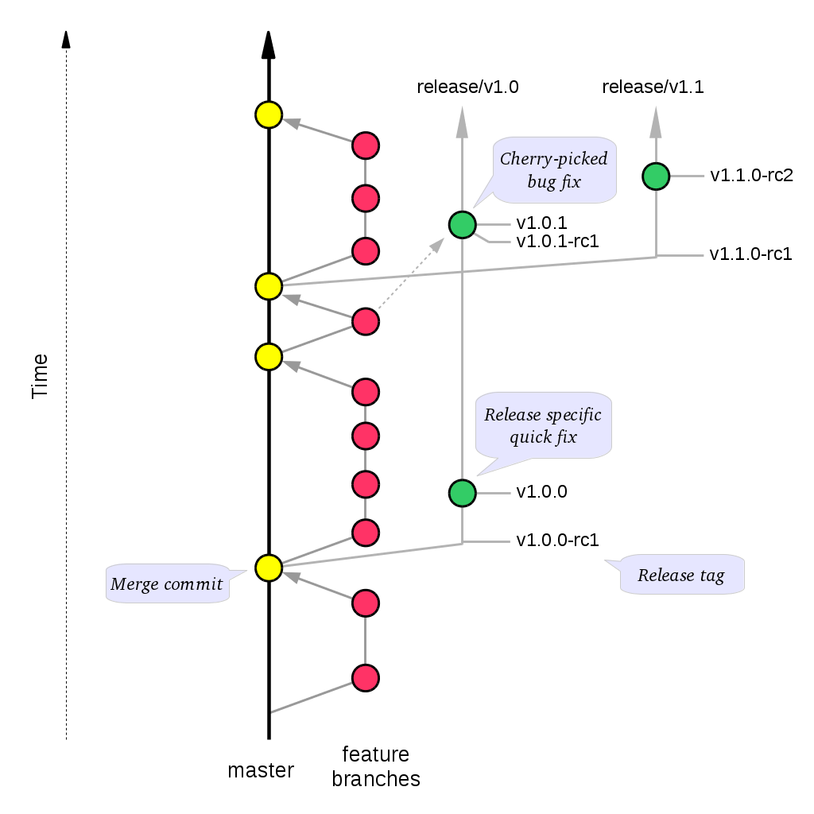

===============
Developer Guide
===============

Additional TODO
===============

-   Incorporate useful information from the *Getting Started* section of the
    wiki: https://github.com/DIA-NZ/webcurator/wiki/Getting-Started .

-   Review existing documents found in the `wct-core/docs` section to extract
    anything useful.

Introduction
============

This guide, designed for a Web Curator Tool developer and contributor, covers
how to develop and contribute to the Web Curatotor Tool. The source for both
code and documentation can be found at: http://dia-nz.github.io/webcurator/

For information on how to install and setup the Web Curator Tool, see the Web
Curator Tool System Administrator Guide. For information on using the Web
Curator Tool, see the Web Curator Tool Quick Start Guide and the Web Curator
Tool online help.

Contents of this document
-------------------------

Following this introduction, the Web Curator Tool Developer Guide includes the
following sections:

-   **Contributing** - covers how to contribute to the project.

-   **Building** - covers building the Web Curator Tool from source.

-   **Developer guidelines** - covers coding practice and development workflow.

-   **Future milestones** - covers plans for future development.

Contributing
============

This describes how to contribute to the Web Curator Tool project.

Source Code Repository
----------------------

Source code for the Web Curator Tool is stored in github at:
http://dia-nz.github.io/webcurator/
Contributors to the codebase will require a github account.

Issue tracking and pull requests
--------------------------------

Issues are tracked via Github's issue tracking. Pull requests are managed with
Github's pull request process.

License
-------

All contributions to the Web Curator Tool must be under the Apache 2.0 License,
which can be found at: https://www.apache.org/licenses/LICENSE-2.0

Major Contributors
------------------

Major contributors to the Web Curator Tool are NLNZ (The National Library of New
Zealand) (https://natlib.govt.nz/ ) and KB (Koninklijke Bibliotheek or The
National Library of the Netherlands) (https://www.kb.nl ). These two
institutions currently drive most development. All contributors are welcome.
Making your interest in the Web Curator Tool known can help to ensure that the
Tool meets your institution's needs.

Development discussion
----------------------

Slack channels are used to discuss current Web Curator Tool development. The
slack channels can be found at https://webcurator.slack.com .

Building
========

Requirements
------------

Building the Web Curator Tool from source requires the following:

-   Java 8 (1.8) JDK or above (64bit recommended). Current development assumes
    using the Oracle JDK, but long-term it may be better to switch to OpenJDK.

-   Maven 3+ or later

-   Git (required to clone the project source from Github)

As the artifact targets are Java-based, it should be possible to build the
artifacts on either Linux, Solaris or Windows targets.

The following platforms have been used during the development of the Web
Curator Tool:

-  Sun Solaris 10

-  Red Hat Linux EL3.

-  Ubuntu GNU/Linux 16.04 LTS and later

-  Windows 7 Ultimate, Windows 2000, Windows XP Pro, Windows Server 2003

Build commands
--------------

Building with unit tests
~~~~~~~~~~~~~~~~~~~~~~~~
::

    mvn clean install

Building and skipping unit tests
~~~~~~~~~~~~~~~~~~~~~~~~~~~~~~~~
::

    mvn clean install -DskipTests=true

Developer Guidelines
====================

Coding practice
---------------

-   We assume common good coding practices. Consider following the principles
    outlined in Robert C. Martin's book *Clean Code*
    (https://www.oreilly.com/library/view/clean-code/9780136083238/ ).

-   New functionality changes have a reasonable set of unit tests included.
    This can be enforced through minimal code coverage tests as part of the
    build process.

Code style
----------

While coding style can be idiosyncratic and personal, consider following
established coding styles enforced through Checkstyle. This ensures that all
code has a similar look and feel while also preventing wasted effort in code
reviews and pull requests discussing formatting. Candidates for a consistent
coding style include:

-   Google Java Style Guide - https://google.github.io/styleguide/javaguide.html
    which is a subset of the Google style guide https://github.com/google/styleguide

-   OpenJDK Java Style Guide - http://cr.openjdk.java.net/~alundblad/styleguide/index-v6.html

-   Spring framework code style - https://github.com/spring-projects/spring-framework/wiki/Code-Style

-   47deg coding guide - https://github.com/47deg/coding-guidelines/tree/master/java/spring

-   Oracle's coding conventions - https://www.oracle.com/technetwork/java/codeconventions-150003.pdf
    Note that this guide is significantly out of date and is only included here
    for historical purposes.

Semantic versioning
-------------------

Use semantic versioning as described in https://semver.org/ . This means having
a version number composed of major, minor and patch versions. For current
development this means changing the maven `pom.xml` associated with each build
artifact and tagging the associated git commit with the version.

TODO Make the steps to change version number is maven and git more explicit,
perhaps as part of the **Git workflow**.

Git Workflow
============

This workflow is a hybrid of several popular git workflows (Github Flow,
Atlassian Simple Git, Cactus Model, Stable Mainline Model), designed to fit the
needs of the NLNZ and KB collaborative development of WCT. It will use a shared
repository model via Github using the https://github.com/DIA-NZ/webcurator
repository.

Commit Messages
---------------

Prefix commit messages with a ticket number (when applicable). This information
comes in handy when reviewing git history, or when cherry-picking individual
commits (e.g. when cherry-picking a bug-fix commit from master into a release
branch, the resulting history will be more informative).

TODO Consider more detail in the commit message, limiting line length.

Commit message example
~~~~~~~~~~~~~~~~~~~~~~
::

    D1.1: Add a unit test for dynamic reflow

Master Branch
-------------

The master branch is the default development branch for this project. For most
purposes, the master branch is considered stable. In other words, if you check
out the master branch you can expect that:

-   It builds on all supported platforms/targets.

-   All unit tests pass (as well as static tests, linter checks and the like).

-   A “standard run” of the software works (WCT should start up).

However, the master branch might not pass a comprehensive QA test at all times.

Feature Development
-------------------

Feature branch purpose
~~~~~~~~~~~~~~~~~~~~~~

All development is done in dedicated (relatively short lived) feature branches.
This is where most of the action takes place, including:

-   Feature development.

-   Code review.

-   Integration testing.

A feature branch branches off from master, and once development is finished and
all the integration criteria have been met, code review completed, it is merged
back to the master branch using a pull request.

|diagramFeaturesGoingIntoMasterBranch|

Feature branch naming
~~~~~~~~~~~~~~~~~~~~~

This project will use the following convention for naming feature branches:
::

    “feature/<ticket>_description_separated_by_underscores”

where ticket is a reference to the corresponding ticket in the project issue
tracker (or work plan), and description is a very short description (up to five
words or so) of the purpose of the branch.

Feature branch naming example:
::

    feature/D1.1_new_harvestagent_h3_impl

If a feature branch is running for an extended period of time, consider breaking
the issue/story into smaller components that can be integrated more frequently
with the master branch.

Updating Feature Branches
~~~~~~~~~~~~~~~~~~~~~~~~~

To keep feature branches up to date with changes in the master branch, it is a
good idea to merge regularly from master to minimize merge conflicts later on
when it is time for a feature to be merged back into master.

While rebasing is considered common practice in keeping feature branches up to
date, in most situations it won’t be appropriate in this project due to sharing
remote branches for pull requests and code review/testing. Rebasing rewrites the
history of a branch and has potential for history breakage when sharing branches.

There are some distinct advantages for rebasing, but it's not recommended given
the current nature of a large codebase in a single repository. When the
codebase gets split into multiple repositories based on functional components
the use of rebasing might be more appropriate.

To update feature branches use merging.

Checking out a branch example:
::

    git checkout feature_branch
    git pull origin master

Reasons for using ‘Always Merge’ convention
~~~~~~~~~~~~~~~~~~~~~~~~~~~~~~~~~~~~~~~~~~~

-   Pull Requests won’t contain rebased commits from master that have already
    been reviewed. You will just see the changes relating to the feature branch.

-   Merging changes from master, ‘rework’ commits, should mean you will only
    need to fix merge conflicts once. Whereas merge conflicts need to be
    resolved every time a rebase is done.

-   Rebasing can be dangerous when used on shared remote branches, as the
    history of the branch is being rewritten.

-   No need to worry about using force push for a branch that has been rebased.

-   Rebasing is generally considered a complex and advanced feature of git. In
    order to make it easier for the community to engage with Web Curator Tool
    developement, it would be wise to keep the project workflow as simple as
    possible.

Code Review and Pull Requests
-----------------------------

Pull Requests are to be used to initiate code reviews and discussions about the
code implementation in a dedicated branch that does not interfere with the main
development branch. This review/testing can done at any stage in the development
of that branch. As a rule, all feature branches must be peer reviewed via Github
before being merged into the master branch.

Sharing a feature branch remotely
~~~~~~~~~~~~~~~~~~~~~~~~~~~~~~~~~

1.  Ensure your feature branch is up to date with latest changes from master.

2.  Push the latest commit from your feature branch to the shared github
    repository.

3.  Fetch remote feature branch into local repository.

Initiating a code review via Github
~~~~~~~~~~~~~~~~~~~~~~~~~~~~~~~~~~~

1.  Ensure your feature branch is up to date with latest changes from master.

2.  Push the latest commit from your feature branch to the shared github
    repository.

3.  Navigate to that branch in Github, and open a Pull Request.

4.  Use WIP if not ready to be merged into master.

5.  Use assigning and mentions to ensure the right people are notified of the
    Pull Request.

After the initial push of a feature branch you can keep pushing updates to the
remote branch multiple times throughout. This can happen in response to
feedback, or because you’re not done with the development of the feature.

Merging into Master
-------------------

Merging feature branches into master will use the no fast forward method. This
forces the creation of merge commits to preserve the notion of the feature
branches in the git history, and also makes it easier to revert a merge if
necessary.

TODO Shouldn't all merges to Master be done via Github pull request? In fact,
the Github master branch should be locked down so that merges are done ONLY by
pull request.

::
    git checkout master
    git merge --no-ff branch

Example of merging with fast forward:
::

    git merge --no-ff feature/DX.Y_desc

If merging a major feature that includes a large number of commits then add the
`--log` flag to the merge command to include a brief description of the commits
that were merged.

Example of merging with log flag:
::

    git merge --no-ff --log feature/DX.Y_desc

Releases
--------

Release branch criteria
~~~~~~~~~~~~~~~~~~~~~~~

This project will use release branches and tags to designate releases. Once it
has been decided what version number to use and what commit to base a release
on, a new release branch is created from the selected commit, and it is never
merged back into master.

|diagramMasterAndFeatureBranches|

Changes to the release branch
~~~~~~~~~~~~~~~~~~~~~~~~~~~~~

After a release branch is announced, only serious bug fixes are included in the
release branch. If possible these bug fixes are first merged into master and
then cherry-picked into the release branch. This way you can't forget to
cherry-pick them into master and encounter the same bug on subsequent releases.

Release branch naming
~~~~~~~~~~~~~~~~~~~~~

Given a regular major.minor.patch version numbering scheme (e.g. semantic
versioning), a release branch should be named `release/vX.Y`, where `X` is the
major version number and `Y` is the minor version number.

Example of release branch naming:
::

    release/v1.3

Git release tags
~~~~~~~~~~~~~~~~

In addition to release branches, release tags are created for each actual
release (this may include release candidates that are intended for QA or beta
testing, as well as public releases). The release tags are made in the
corresponding release branch.

The commit that represents a specific release is tagged with a tag named
`vX.Y.Z`, optionally suffixed with a textual identifier, such as `-alpha`,
`beta`, `-rc1`.

Example of release tag:
::

    v1.3.2-rc1

Patch versions
~~~~~~~~~~~~~~

The first release version from the `vX.Y` release branch, is tagged with the
patch version `0`, eg. `vX.Y.0`. Every time a bug-fix is included in a release
branch the patch version is raised (to comply with Semantic Versioning) by
setting a new tag.

When no more bugs are found, tag the tip of the release branch with `vX.Y.Z`
(it is no longer a release candidate), and if necessary make a final build (e.g.
to get the release number correct in the release package etc).

Continuous Integration (placeholder)
------------------------------------

TODO Write notes and instructions for continuous integration.

Future milestones
=================

Future milestones are divided into several different phases, some of which can
be pursued independently.

Audit usage
-----------

Future development work may involve restructuring the application code and
applying technical upgrades to underlying frameworks. The technical direction
of code changes also relies on ensuring that the Web Curator Tool meets the
needs of its current and potential future users. Application functionality needs
verification throughout all steps of restructuring, uplift and functional
enhancement. For this reason, developers need to understand and duplicate
current usage by:

1.  Understanding who uses the Web Curator Tool and how they use it.

2.  Provide a set of key user journeys. These user journeys cover all essential
    functionality in how the tool is used.

3.  Write unit and/or integration tests that cover those essential user journeys.
    These tests are used to ensure that all essential functionality remains
    through all development changes.

Containerization and continuous integration
-------------------------------------------

Containerization
~~~~~~~~~~~~~~~~

Containerization ensures that each Web Curator Tool can run in its own
container connected to other containers. (TODO Describe the advantages of
containerization and what it means for the WCT).

Repository split
~~~~~~~~~~~~~~~~

Splitting the single Web Curator Tool into multiple repositories means that the
each component can be developed, built, versioned and released independently
from the other components. This provides the advantage of decoupling the
components. Decoupling is predicated on reliable interfaces connecting each
component.

Continuous integration through build and deploy pipeline
~~~~~~~~~~~~~~~~~~~~~~~~~~~~~~~~~~~~~~~~~~~~~~~~~~~~~~~~

A preconfigured build and deploy pipeline (or pipeline template) allows
developers to quickly build and test changes and put new releases into
production.

Ease of installation
~~~~~~~~~~~~~~~~~~~~

Part of the reason to move to a containerisation approach with a build and
deploy pipeline is to make it easier for users to easily build, stand up and
run the Web Curator Tool in a production environment. It also means that
component upgrades are much easier to roll out by component (so one component
can receive an upgrade/code change without requiring all components be changed).

Quality assurance improvements
------------------------------

In addition to providing a testable set of user journeys and an easy-to-use
build and deploy pipeline, additional changes that ensure code quality,
including:

-   More comprehensive logging at all API points.

-   Better enforcement of coding quality and standards through build-time
    enforcement using such things as PMD static code analysis
    (https://pmd.github.io/ ), Jacoco code coverage
    (https://www.eclemma.org/jacoco/ ), FindBugs
    (http://findbugs.sourceforge.net/ ), Checkstyle for coding style
    (http://checkstyle.sourceforge.net/ ), SonarQube for code quality
    (https://www.sonarqube.org/ ) and others.

-   Switch to Test-Driven Development.

-   Consistently applied coding and development standards.

Component based REST API
------------------------

APIs ensure that the different components can talk to each other through
standard interfaces. Currently communication between components is handled via
SOAP interfaces. The technical uplift would move the API interfaces to REST.
The API would allow for decoupling of the components and more flexibility in
how the Web Curator Tool is structured for use in production. Several potential
API candidates exist:

1.  Agent API - A generic wrapper supporting different crawlers, such as
    Heritrix1, Heritrix3 and other potential crawlers, such as WebRecorder.
    Re-develop WCT Core and Harvest Agent to be crawler agnostic, allowing other
    crawl tools to be utilised by WCT. Harvest Agent pooling/grouping also
    required to allocate scheduled Targets to different crawl tools.

2.  Workflow API - This would separate out the workflow into a separate
    component to allow easier integration with other systems.

3.  Administration API - For management of users, roles and other administrative
    components.

4.  Configuration API - For easier management of configuration so that
    run time values are contained in a single location instead of being spread
    across properties files, xml files and hard-coded in the codebase.

Technical uplift
----------------

Upgrade the frameworks and technologies that underpin the Web Curator Tool.
This technical shift is aimed at ensuring that the technologies used are
supported and effective.

Uplift components
~~~~~~~~~~~~~~~~~

+-------------------+-------------------------------+--------------------------+
| Technology        | Reasoning                     | Alternatives             |
+===================+===============================+==========================+
| Java 11 (OpenJDK) | Java 11 is the latest         | Possibly Java 8. But     |
|                   | version. Containerization     | long-term support ends   |
|                   | helps limit exposure of       | in 2023.                 |
|                   | co-located applications.      |                          |
+-------------------+-------------------------------+--------------------------+
| Spring 5.x        | Latest version.               | None.                    |
+-------------------+-------------------------------+--------------------------+
| Spring boot       | Simplify deployment. Light-   | Deploy as war.           |
|                   | weight and more compatible    |                          |
|                   | with microservice approach.   |                          |
+-------------------+-------------------------------+--------------------------+
| REST (API)        | More universally supported    |                          |
|                   | and compatible with micro-    |                          |
|                   | service approach.             |                          |
+-------------------+-------------------------------+--------------------------+
| Quartz 2.3.0      | Latest version.               | Spring scheduler, which  |
|                   |                               | is a bit simpler.        |
+-------------------+-------------------------------+--------------------------+
| GUI framework     | Major upgrade. Decoupled from | None. Struts 1.2.7 is    |
|                   | back-end services via REST API| long-unsupported,        |
|                   | (REST API allows for custom   | difficult to use and     |
|                   | clients). No specific         | maintain.                |
|                   | technology has been proposed. |                          |
+-------------------+-------------------------------+--------------------------+
| JPA (Hibernate)   | Standard way of interfacing   | Straight JDBC or MyBatis,|
|                   | with database. This would     | which allows for writing |
|                   | include an upgrade to latest  | SQL instead of a generic |
|                   | Hibernate (currently 5.3.x).  | wrapper like Hibernate.  |
+-------------------+-------------------------------+--------------------------+
| Microservices     | Decouple application          | Keep as monolith.        |
|                   | into focused components.      |                          |
+-------------------+-------------------------------+--------------------------+
| Gradle builds     | A more flexible build tool    | Keep using maven.        |
|                   | that makes build and deploy   |                          |
|                   | pipelines easier to write.    |                          |
+-------------------+-------------------------------+--------------------------+

Additional uplift notes
~~~~~~~~~~~~~~~~~~~~~~~

-   Java 11 - OpenJDK has moved from version 8 to 11, so it makes sense to
    make the same leap. If the Web Curator Tool is a monolith, this could
    cause issues because it means that all co-located applications (as in, those
    applications running on the same machine) would need to upgrade as well.
    However, running the Web Curator Tool components in containers means that
    the container itself would have the Java version required.

-   Spring boot - Spring boot applications are deployed as Java jars. This can
    simplify application deployment.

-   REST (API) - In order to maintain a working Web Curator Tool throughout
    the upgrade process, the REST API would be incorporated into the existing
    codebase as upgraded component by component.

-   GUI framework - Exposing all Web Curator Tool functionality through REST API
    services allows for different GUI frameworks to run against the same API.
    Some research is necessary to determine a suitable technology, one that
    is well supported, easy to work with and having a large user base.

-   JPA (Hibernate) - Hibernate tends to obscure the underlying SQL. It may be
    more effective to write all SQL queries in ANSI SQL so they run across all
    database flavours without change. Using straight JDBC or MyBatis could make
    development and maintenance much easier to understand, allowing less
    experienced (and not Hibernate savvy) developers participate. There doesn't
    seem to be an inherent requirement for using SQL, so consider whether NoSQL
    might work better.

..  |diagramFeaturesGoingIntoMasterBranch| image:: ../_static/developer-guide/diagram-features-going-into-master-branch.png
    :width: 242.13px
    :height: 296.50px

