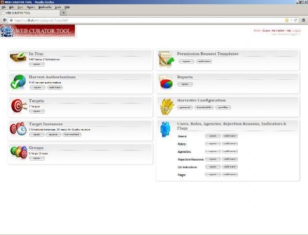
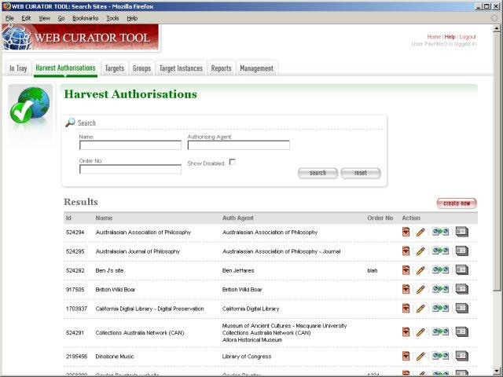
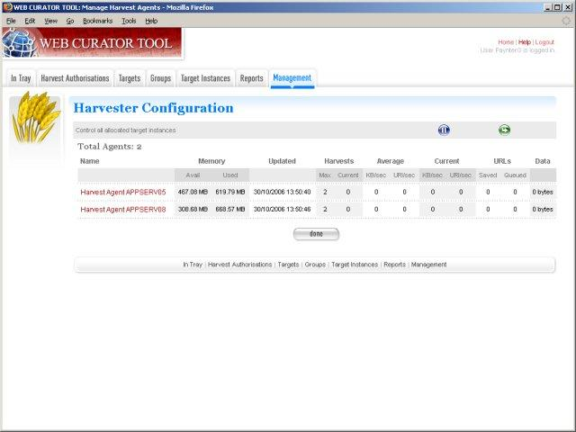
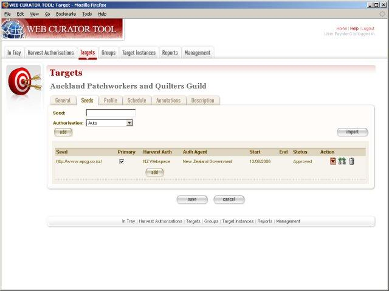
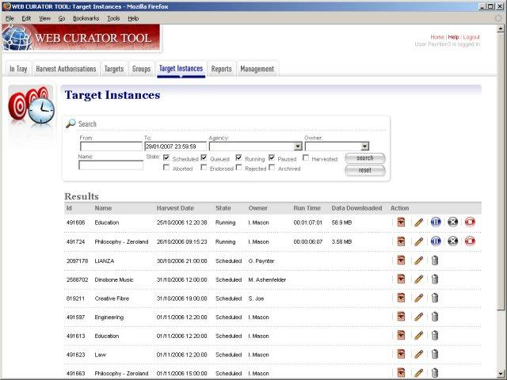
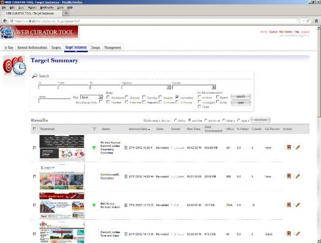

==========================
Overview and History
==========================

Additional TODO
===============

-   Add details of work from 2017 onwards  between NLNZ and KB-NL.

Introduction
============

This guide, designed for non-technical users, provides a background and history of the Web Curator Tool.

Contents of this document
-------------------------

Following this introduction, the Web Curator Tool Overview and History Guide includes the following sections:

-   **Overview** - Covers what the Web Curator Tool is and what it is not.

-   **Screenshots** - Some screenshots of the Web Curator Tool.

-   **History** - Covers the history of the tool from its inception to today.

-   **License**  - Covers the license used.

-   **Release history** - Covers significant changes made in each release.

Overview
========

The Web Curator Tool (WCT) is a tool for managing the selective web harvesting process, and is designed for use in
libraries by non-technical users. It is integrated with v1.14.1 of the Heritrix web crawler which is used to download
web material (but technical details are handled behind the scenes by system administrators).

The WCT supports
----------------

-   Harvest Authorisation: getting permission to harvest web material and make it available.
-   Selection, scoping and scheduling: what will be harvested, how, and how often?
-   Description: Dublin Core metadata.
-   Harvesting: Downloading the material at the appointed time with the Heritrix web harvester deployed on multiple
    machines.
-   Quality Review: making sure the harvest worked as expected, and correcting simple harvest errors.
-   Submitting the harvest results to a digital archive.

What it is *NOT*
----------------

-   It is *NOT* a digital archive or document repository
    -   It is not appropriate for long-term storage
    -   It submits material to an external archive
-   It is *NOT* an access tool
    -   It does not provide public access to harvested material
    -   (But it does let you review your harvests)
    -   You should use Wayback or WERA as access tools
-   It is *NOT* a cataloguing system
    -   It does allow you to record external catalog numbers
    -   And it does allow you to describe harvests with Dublin Core metadata
-   It is *NOT* a document management system
    -   It does not store all your communications with publishers
    -   But it may initiate these communications
    -   And it does record the outcome of these communications

The Web Curator Tool supports a harvesting workflow comprising a series of specialised tasks:
    -   selecting an online resource
    -   seeking permission to harvest it and make it publicly accessible
    -   describing it
    -   determining its scope and boundaries
    -   scheduling a web harvest or a series of web harvests
    -   performing the harvests
    -   performing quality review and endorsing or rejecting the harvested material
    -   and depositing endorsed material in a digital repository or archive.

Most current web archiving activities rely heavily on the technical expertise of the harvest operators. The Web Curator
Tool, on the other hand, makes harvesting the responsibility of users and subject experts (rather than engineers and
system administrators) by handling automatically the technical details of web harvesting. The tool is designed to
operate safely and effectively in an enterprise environment, where technical support staff can maintain it.

Screenshots
===========

|screenshot_home|

|screenshot_harvest_authorisations|

|screenshot_harvester_configuration|

|screenshot_targets|

|screenshot_target_instances|

|screenshot_target_summary|

History
=======

The National Library of New Zealand has a legal mandate, and a social responsibility, to preserve New Zealand's social
and cultural history, be it in the form of books, newspapers and photographs, or of websites, blogs and videos.
Increasing amounts of New Zealand's documentary heritage is only available online. Users find this content valuable and
convenient, but its impermanence, lack of clear ownership, and dynamic nature pose significant challenges to any
institution that attempts to acquire and preserve it.

The Web Curator Tool was developed to solve these problems by allowing institutions to capture almost any online
document, including web pages, web sites, and web logs, and most current formats, including HTML pages, images, PDF and
Word documents, as well as multimedia content such as audio and video files. These artifacts are handled with all
possible care, so that their integrity and authenticity is preserved. The public benefit from the safe, long-term
preservation of New Zealand's online heritage is incalculable. Our online social history and much government and
institutional history will be able to be preserved into the future for researchers, historians, and ordinary
New Zealanders. They will be able to look back on our digital documents in the same way that the New Zealanders of today
look back on the printed words left to us by previous generations.

The software was developed as a collaborative project between the National Library of New Zealand and the British
Library, conducted under the auspices of the International Internet Preservation Consortium. The Web Curator Tool has
been built with support and contributions from professionals at the National Library of New Zealand, the British
Library, Sytec Resources Ltd., `Oakleigh Consulting <http://www.oakleigh.co.uk>`_, the National Library of Australia,
the Library of Congress, and many others.

Project objectives
------------------

-   Meets the needs of the National Library of New Zealand
-   Meets the needs of the British Library
-   Is modular and can be extended to meet the needs of IIPC members and other organizations engaging in web harvesting
-   Manages permissions, selection, description, scoping, harvesting and quality review
-   Provides a consistent, managed approach allowing users with limited technical knowledge to easily capture web
    content for archival purposes.
-   The National Library of New Zealand has used the Web Curator Tool as the basis of its selective web archiving
    programme since January 2007. It is the primary tool and responsibility of the web archivists in the Alexander
    Turnbull Library.

The tool is open-source software and is freely available for the benefit of the international web archiving community.

License
=======

The Web Curator Tool is available under the terms of the Apache License, Version 2.0.

The tool is open-source software and is freely available for the benefit of the international web archiving community.

See the *Contributing* section of the :doc:`Developer Guide <developer-guide>` for more details.

Release history
===============

See :doc:`Release Notes <release-notes>` for release notes on specific versions.

15 March 2016 - 1.6.2 GA
------------------------

This version includes bugfixes developed by the National Library of New Zealand between June 2015 and March 2016. This
release fixes bugs relating to indexing, pruning and importing, duplicate schedules and more. The changes will benefit
all existing WCT users and we recommend that users upgrade to 1.6.2

9 May 2014 - 1.6.1 GA
---------------------

This version includes bugfixes and enhancements developed by the National Library of New Zealand between July and
November 2013. This release streamlines the Webcurator workflow by adding date pickers for date fields; a heat map when
scheduling harvests; harvest optimisation; Target description search and non-English character support. These features
will benefit all existing WCT users and we recommend that users upgrade to 1.6.1

05 December 2012 - 1.6 GA
-------------------------
This version includes bugfixes and enhancements developed by the British Library between June and September 2012. This
release streamlines the Webcurator workflow and enhances the automated quality assurance (QA) features. These features
will benefit all existing WCT users and we recommend that users upgrade to 1.6.

22 August 2011 - 1.5.2 GA
-------------------------

This version includes many bugfixes and new features that were commissioned by The British Library and developed during
March and April of 2011 by software developers from `Oakleigh Consulting <http://www.oakleigh.co.uk>`_ in the UK. The new
features will be of benefit to all existing WCT users and we recommend that all users upgrade to 1.5.2.

10 December 2010 - 1.5.1 GA
---------------------------

This version includes many bugfixes, new features and performance improvements that were commissioned by The British
Library and developed over two iterations during February and June of 2010 by software developers from Oakleigh
Consulting in the UK. The new features will be of benefit to all existing WCT users and we recommend that all users
upgrade to 1.5.1.

11 November 2009 - 1.5 GA
-------------------------

This version is mainly concerned with the optional integration of Wayback as an additional quality review tool, and the
simplification of system configuration using properties files; but also contains a small number of additional
enhancements and bugfixes. This release was commissioned by The British Library and developed during July and August of
2009 by software developers from `Oakleigh Consulting <http://www.oakleigh.co.uk>`_ in the UK. The new features will be
of benefit to all existing WCT users and we recommend that WCT 1.1, 1.2.7, 1.3 and 1.4.x users upgrade to 1.5.

27 May 2009 - 1.4.1 GA
----------------------

Version 1.4.1 of the Web Curator Tool is now available on Sourceforge. This version includes many bugfixes and an
upgrade to Heritrix 1.14.1. There are also some new features and performance improvements that were commissioned by The
British Library and developed over two iterations during September-October of 2008 and February-March of 2009 by
software developers from `Oakleigh Consulting <http://www.oakleigh.co.uk>`_ in the UK. The new features will be of
benefit to all existing WCT users and we recommend that WCT 1.1, 1.2.7, 1.3 and 1.4 users upgrade to 1.4.1.

29 July 2008 - 1.4 GA
---------------------

This version includes an upgrade to Heritrix 1.14 and Wayback 1.2 as well as many new features and some performance
improvements that were commisioned by The British Library and developed during an accelerated effort in April and June
of 2008 by software developers from `Oakleigh Consulting <http://www.oakleigh.co.uk>`_ in the UK. The new features will
be of benefit to all existing WCT users and we recommend that WCT 1.1, 1.2.7 and 1.3 users upgrade to 1.4.0.

Older releases
--------------

-   19 February 2008 - 1.3 GA

-   20 August 2007 - 1.2.7 GA

-   03 April 2007 - 1.1.1 Beta

-   21 September 2006 - 1.1 GA

-   21 August 2006 - 1.0 RC

-   25 July 2006 - 0.4 Beta

