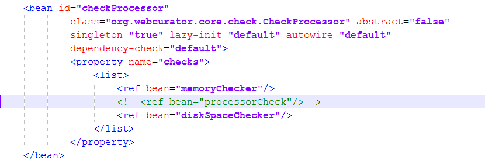
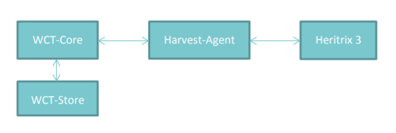

==========================
System Administrator Guide
==========================

Introduction
=====================

This guide, designed for a System Administrator, covers installation and
setup of the Web Curator Tool. An electronic copy can be downloaded from
the WCT Github site: http://dia-nz.github.io/webcurator/

For information on using the Web Curator Tool, see the Web Curator Tool
Quick Start Guide and the Web Curator Tool online help.

Contents of this document
------------------------------

Following this introduction, the Web Curator Tool System Administrator
Guide includes the following sections:

-  **Getting Started** - covers prerequisites, supported
   platforms, other platforms, and optional prerequisites for using the
   Web Curator Tool.

-  **Setting up the WCT database** - procedures for setup using
   Oracle, MySQL and PostgreSQL.

-  **Setting up the WCT Application Servers** - procedures for
   deploying WCT to Tomcat, includes configuration options and
   troubleshooting.

-  **Setting up Heritrix 3** - procedures for building and running
   the Heritrix 3 web crawler to intergrate with WCT, includes
   configuration options and troubleshooting.

-  **Appendix A: Creating a truststore and importing a certificate**

-  **Appendix B: The OMS archive adapter**

Getting Started
=====================

The following section explains how to get the Web Curator Tool up and
running.

Prerequisites
----------------------------

The following are required to successfully install and run the Web
Curator Tool:

-  Java 1.8 JDK or above (64bit recommended)

   *During development of the latest version it was noted that large harvests
   would sometimes fail to transfer from the Harvest Agent to Store on
   completion. This was resolved by running Apache Tomcat with 64 bit Java.*

-  Apache Tomcat 8.x.x or above (the application has been tested on
   Tomcat 8.5.32)

-  A database server (select one of the databases below)

   -  Oracle 11g

   -  PostgreSQL 8.4.9.

   -  MySQL 5.0.95

Other versions of the required products may be compatible with the Web
Curator Tool but they have not been tested. Due to the products use of
Hibernate for database persistence other database platforms should work,
if the product is rebuilt with the correct database dialect. However
only Postgesql, Oracle 11g, and MySQL have been tested.

Supported platforms
-------------------

The following platforms have been used during the development of the Web
Curator Tool:

-  Sun Solaris 10

-  Red Hat Linux EL3.

Other platforms
---------------

The following platforms were used during the Development of the Web
Curator tool but are not explicitly supported:

-  Windows 2000, Windows XP Pro, Windows Server 2003, Windows 7 Ultimate

Optional prerequisites
----------------------

The following prerequisites are optional:

-  LDAP compliant directory (for external authentication)

-  Apache Maven 3+ (required to build from source).

- Git (can be used to clone the project source from Github)

Setting up the WCT database
=====================================

Currently the WCT has been tested with Oracle 11g, MySQL 5.0.95 and
PostgreSQL 8.4.9.

Setup using Oracle 11g
----------------------

*This guide assumes you have installed and configured Oracle 11g prior to
setting up the WCT database and schema.*

1. Setup two schemas: one called DB_WCT that owns the tables and one
   called USR_WCT that the application uses to query the tables. The
   USR_WCT schema should have limited rights. You can use a script
   similar to the following:

::

    create user db_wct identified by password default tablespace wct_data quota unlimited on wct_data;

    create user usr_wct identified by password default tablespace wct_data quota unlimited on wct_data;

    grant create session to usr_wct;

    grant connect,resource to db_wct;

2. Run the following SQL scripts under the DB_WCT user or SYSTEM
   account:

::

    sql/wct-schema-1_6_1-oracle.sql

    sql/wct-schema-grants-1_6_1.sql

    sql/wct-indexes-1_6_1-oracle.sql

    sql/wct-oracle-bootstrap.sql

    sql/wct-qa-data-1_6-oracle.sql

*The wct-qa-data-1_6-oracle.sql script will generate QA indicator
template data for the new QA module for each agency, and should be run*
**once all agencies have been added to WCT**. *Note that if the script is
re-run, it will clear out any existing template data.*

3. Locate the correct JDBC driver for Oracle, which should be
   distributed with the Oracle install media.

   - The JDBC driver should be called ojdbc1411g.jar
   - The driver will need to be placed into the $TOMCAT_HOME/common/lib/ directory.
   - Also required in this directory is the jta.jar

*Notes: A password strategy should be defined for the system, and the
db_wct & usr_wct passwords should be changed in the scripts and
application property files to conform to this strategy. To encourage
this, the passwords in the supplied database creation script are not set
to 'password'.*

*The bootstrap user script creates a User with a name of ‘bootstrap' and
a password of 'password'. Use this account to login to the application
once it is up and running. You can use the bootstrap account to create
other users and agencies. Once you have setup valid users, it is best to
disable the bootstrap user for security reasons.*

Setup using PostgreSQL 8.4.9
----------------------------

*This guide assumes you have installed and configured PostgreSQL 8.4.9
prior to setting up the WCT database and schema.*

1. Setup two schema::

    CREATE DATABASE "Dwct" WITH ENCODING='UTF8';

    \\c Dwct

    CREATE SCHEMA db_wct;

    CREATE ROLE usr_wct LOGIN PASSWORD 'password' NOINHERIT VALID UNTIL 'infinity';

    grant usage on schema db_wct to usr_wct;

2. Then run the following SQL scripts under the DB_WCT user::

    sql/wct-schema-1_6_1-postgresql.sql
    
    sql/wct-schema-grants-1_6_1.sql
    
    sql/wct-indexes-1_6_1-postgresql.sql
    
    sql/wct-postgres-bootstrap.sql
    
    sql/wct-qa-data-1_6-postgres.sql

*The wct-qa-data-1_6-postgres.sql script will generate QA indicator
template data for the new QA module for each agency, and should be run*
**once all agencies have been added to WCT**. *Note that if the script is
re-run, it will clear out any existing template data.*

3. The Postgres JDBC driver is included in the CVS repository under
   /etc/ directory.

   - The Postgres driver is called postgresql-8.1-404.jdbc3.jar
   - The driver will need to be placed into the $TOMCAT_HOME/common/lib/ directory.
   - Also required in the $TOMCAT_HOME/common/lib/ directory is the jta.jar

*Notes: A password strategy should be defined for the system, and the
usr_wct password should be changed in the scripts and application
property files to conform to this strategy. To encourage this, the
password in the supplied database creation script is not set to
'password'.*

*The bootstrap user script creates a User with a name of 'bootstrap' and
a password of 'password'. Use this account to login to the application
once it is up and running. You can use the bootstrap account to create
other users and agencies. Once you have setup valid users, it is best to
disable the bootstrap user for security reasons.*

Setup using MySQL 5.0.95
------------------------

This guide assumes you have installed and configured MySQL 5.0.95 prior
to setting up the WCT database and schema.

1. Create the database::

    CREATE DATABASE DB_WCT;

    \\u DB_WCT

    create user usr_wct@localhost identified by 'password';

    grant all on DB_WCT.\* to usr_wct@localhost;

2. Then run the following SQL scripts under the root user::

    sql/wct-schema-1_6_1-mysql.sql

    sql/wct-schema-grants-1_6_1-mysql.sql

    sql/wct-indexes-1_6_1-mysql.sql

    sql/wct-mysql-bootstrap.sql

    sql/wct-qa-data-1_6-mysql.sql

*The wct-qa-data-1_6-mysql.sql script will generate QA indicator template
data for the new QA module for each agency, and should be run* **once all
agencies have been added to WCT**. *Note that if the script is re-run, it
will clear out any existing template data.*

3. Download the MySQL JDBC driver from the MySQL website.

   -  The driver will need to be placed into the $TOMCAT_HOME/common/lib/ directory.
   -  Also required in the $TOMCAT_HOME/common/lib/ directory is the jta.jar

*Notes: A password strategy should be defined for the system, and the
usr_wct password should be changed in the scripts and application
property files to conform to this strategy. To encourage this, the
password in the supplied database creation script is not set to
'password'.*

*The bootstrap user script creates a User with a name of ‘bootstrap' and
a password of 'password'. Use this account to login to the application
once it is up and running. You can use the bootstrap account to create
other users and agencies. Once you have setup valid users, it is best to
disable the bootstrap user for security reasons.*

Setting up the WCT Application Servers
================================================

Deploying WCT to Tomcat
-----------------------

There are three major components to the deployment of the Web Curator
Tool:

-  the web curator core (wct.war)
-  the web curator harvest agent (wct-harvest-agent.war)
-  the web curator digital asset store (wct-store.war).

| Each of these three components must be deployed for the Web Curator
  Tool to be fully functional and more than one harvest agent can be
  deployed if necessary. Each Harvest Agent is capable of carrying out
  harvest actions. The more harvest agents deployed the more harvesting
  that can be done at any one point in time. The harvest agents and
  digital asset store can reside on any machine within the network, as
| they use SOAP over HTTP to communicate with each other.

To deploy WCT to Tomcat:

-  Make sure you have installed and configured both Java 1.5 JDK and Apache-Tomcat 5.5.X successfully.
-  Set up the JMX Remote control and access files for the WCT core and
   every Harvest Agent.

   -  Create a jmxremote.password file by copying the file
      jmxremote.password.template this file will be in your JDK's
      jre\lib\management directory.

      *You can use the property -Dcom.sun.management.jmxremote.password.file
      to point to a different location.*

   -  It is important that this file is protected. If using Windows, refer
      to the following link to protect the file using the O/S:
      http://java.sun.com/j2se/1.5.0/docs/guide/management/security-windows.html

   -  If using \*nix platform, protect the file using::

        chmod 600 jmxremote.password.

   -  Also enable the JMX Remote port (any high port can be used) by adding
      the following to your $TOMCAT_HOME/bin/catalina.sh script::

        JAVA_OPTS=-Dcom.sun.management.jmxremote.port=9004

      **IMPORTANT:** *Make sure this change is applied to the Core and any Harvest Agent deployed onto a different machine.*

-  Deploy the WAR files into Tomcat. The simplest deployment is to
   deploy all three WAR files into the same Tomcat container.

   -  You can copy the WAR files into the $TOMCAT_HOME/webapps/ directory.
   -  Provided Tomcat is configured correctly, when you start Tomcat the
      WAR files will be exploded and the application will start.

-  Shut down Tomcat once the WAR files have been extracted. This will
   allow you to modify the configuration files in the following steps.

Configure the Database Connection
~~~~~~~~~~~~~~~~~~~~~~~~~~~~~~~~~

The open source version of the Web Curator Tool is configured to use a
local PostgreSQL database. If you are using any other database, or are
using a database server, you will need to change the database
configuration.

-  Set the correct database dialect in
   TOMCAT/webapps/wct/WEB-INF/classes/\ **wct-core.properties**::

    #Hibernate Settings

    hibernate.dialect=org.hibernate.dialect.PostgreSQLDialect
    hibernate.default_schema=DB_WCT

   The appropriate dialects are shown in the table below.

   ==========  =======
   Database    Dialect
   ==========  =======
   Oracle      org.hibernate.dialect.OracleDialect
   PostgreSQL  org.hibernate.dialect.PostgreSQLDialect
   MySQL       org.hibernate.dialect.MySQLDialect
   ==========  =======

-  Edit the context.xml file in TOMCAT/webapps/wct/META-INF::

    <?xml version="1.0" encoding="UTF-8"?>
    <Context>
        <Resource
            name="jdbc/wctDatasource"
            type="javax.sql.DataSource"
            password="**PASSWORD**"
            driverClassName="**DRIVER**"
            maxIdle="2"
            maxWait="5000"
            validationQuery="**VALIDATION_QUERY**"
            username="**USERNAME**"
            url="**JDBC_URL**"
            maxActive="10 "/>
    </Context>

   Set the username and password properties as appropriate for your
   database. If you have followed the defaults, then these should remain
   as USR_WCT/USR_WCT.

   The remaining properties should be set as follows:

   **Oracle**

   ================ ================
   Attribute        Value
   ================ ================
   DRIVER           oracle.jdbc.driver.OracleDriver
   VALIDATION_QUERY select count(1) from DUAL
   JDBC_URL         jdbc:oracle:thin:@servername:port/SID
   ================ ================

   **PostgreSQL**

   ================ ================
   Attribute        Value
   ================ ================
   DRIVER           org.postgresql.Driver
   VALIDATION_QUERY select 1+1
   JDBC_URL         jdbc:postgresql://servername:port/database
   ================ ================

   **MySQL**

   ================ ================
   Attribute        Value
   ================ ================
   DRIVER           com.mysql.jdbc.Driver
   VALIDATION_QUERY select 1+1
   JDBC_URL         jdbc:mysql://servername:port/database
   ================ ================

-  Copy the context.xml file to the TOMCAT/conf/Catalina/localhost
   directory. Delete the existing wct.xml file if it exists. Now rename
   the context.xml file to wct.xml.

Configure LDAP Authentication (Unencrypted)
~~~~~~~~~~~~~~~~~~~~~~~~~~~~~~~~~~~~~~~~~~~

-  If you wish to use an external Directory for Authentication, then WCT
   should be configured to allow this. Unencrypted authentication can be
   done very simply with your directory by modifying the
   wct-core-security.xml and the wct-core.properties file.

   *The Directory must support LDAP.*

   In wct-core-security.xml, uncomment the ldapAuthenticator bean::

    <bean id="authenticationManager"
    class="org.acegisecurity.providers.ProviderManager" abstract="false"
    singleton="true" lazy-init="default" autowire="default"
    dependency-check="default">
        <property name="providers">
            <list>
                <ref bean="ldapAuthenticator" />
                <ref bean="daoAuthenticationProvider" />
            </list>
        </property>
    </bean>

   In wct-core.properties, set the following parameters::

    #LDAP Settings
    ldap.url=ldap://yourldaphost.domain.com:389
    ldap.dn=cn={0},OU=OrgUnit,O=Organisation

   The two parameters of interest are:

   -  ldap.url, which defines the URL for the directory. This is normally
      something like ldap://mydirectory.natlib.co.nz/

   -  ldap.dn. This allows the Directory DN to be defined. For example, if
      a user logs in with the username "gordonp" the Directory will be
      queried using the distinguished name of "cn=gordonp, ou=wct,
      o=global". So the user must exist within the global organisation and
      the wct organisation unit.

Configure LDAP Authentication (Encrypted using TLS or SSL)
~~~~~~~~~~~~~~~~~~~~~~~~~~~~~~~~~~~~~~~~~~~~~~~~~~~~~~~~~~

-  If you want all credentials passed to the Directory server to be
   protected then the ldap traffic should be encrypted using TLS or SSL.

   - The only difference to the wct-core.properties file from step 4 is the following change::

        ldap.url=ldaps://yourldaphost.domain.com:389

   - If using TLS or SSL then you must configure Tomcat to allow secure
     communication with your Directory by adding the following to your
     $TOMCAT_HOME/bin/catalina.sh script::

        JAVA_OPTS= -Djavax.net.ssl.trustStore=/var/wctcore/ssl/wct.ts
        -Djavax.net.ssl.trustStorePassword=password

     This points tomcat to a Truststore that contains the public key for you
     directory. If your directory utilises a correctly signed certificate,
     you may not need this, as the default truststore provided by Java
     contains all the major root certificates. However if you directory uses
     a self-signed certificate then you will need to export the public key of
     that certificate and import it into your truststore (i.e.
     /var/wctcore/ssl/wct.ts). Alternatively you can import the self-signed
     certificate into the default Java truststore.

     *For details on how to create a truststore and import a certificate,
     see Appendix A: Creating a truststore and importing a certificate.*

Configure the Digital Asset Store
~~~~~~~~~~~~~~~~~~~~~~~~~~~~~~~~~

-  Set the Base Directory of the Digital Asset Store to a valid location
   on the server. Also make sure the directory or share has enough free
   disk space.

   The configuration for the DAS is found in the **wct-das.properties** file::

    #WctCoreWsEndpoint

    wctCoreWsEndpoint.service=/wct/services/urn:WebCuratorTool
    wctCoreWsEndpoint.host=localhost
    wctCoreWsEndpoint.port=8080

    #ArcDigitalAssetStoreService

    # the base directory for the arc store
    arcDigitalAssetStoreService.baseDir=/tmp/arcstore

Configure a Harvest Agent
~~~~~~~~~~~~~~~~~~~~~~~~~

-  Make sure the following parameters are correct for your environment
   in the **wct-agent.properties** file::

    #HarvestAgent

    # name of the directory where the temporary harvest data is stored
    harvestAgent.baseHarvestDirectory=/wct/harvest-agent
    # agent host name or ip address that the core knows about
    harvestAgent.host=localhost
    # the port the agent is listening on for http connections
    harvestAgent.port=8080
    # the max number of harvest to be run concurrently on this agent
    harvestAgent.maxHarvests=2
    # the name of the agent. must be unique
    harvestAgent.name=My local Agent
    # the note to send with the harvest result.
    harvestAgent.provenanceNote=Original Harvest
    # the number of alerts that occur before a notification is sent
    harvestAgent.alertThreshold=200

    #HarvestCoordinatorNotifier

    # the name of the core harvest agent listener web service
    harvestCoordinatorNotifier.service=/wct/services/urn:WebCuratorTool
    # the host name or ip address of the core
    harvestCoordinatorNotifier.host=localhost
    # the port that the core is listening on for http connections
    harvestCoordinatorNotifier.port=8080

    #DigitalAssetStore

    # the name of the digital asset store web service
    digitalAssetStore.service=/wct-store/services/urn:DigitalAssetStore
    # the host name or ip address of the digital asset store
    digitalAssetStore.host=localhost
    # the port that the digital asset store is listening on for http connections
    digitalAssetStore.port=8080

    ...

    #Triggers

    # startDelay: delay before running the job measured in milliseconds
    # repeatInterval: repeat every xx milliseconds (Note that once a day is
    86,400,000 millseconds)

    heartbeatTrigger.startDelay=10000
    heartbeatTrigger.repeatInterval=30000

-  In addition to setting the Harvest Agent parameters, you may also
   want to change the default Heritrix profile that is shipped with the
   WCT. The most likely settings to change are what web proxy server to
   use when harvesting content. The setting can be found in the
   **WEB-INF/classes/default-profile.xml**::

    <newObject name="HTTP" class="org.archive.crawler.fetcher.FetchHTTP">
        <boolean name="enabled">true</boolean>
        <map name="filters">
        </map>
        <map name="midfetch-filters">
        </map>
        <integer name="timeout-seconds">1200</integer>
        <integer name="sotimeout-ms">20000</integer>
        <long name="max-length-bytes">0</long>
        <boolean name="ignore-cookies">false</boolean>
        <boolean name="use-bdb-for-cookies">true</boolean>
        <string name="load-cookies-from-file"></string>
        <string name="save-cookies-to-file"></string>
        <string name="trust-level">open</string>
        <stringList name="accept-headers">
        </stringList>
        <string name="http-proxy-host"></string>
        <string name="http-proxy-port"></string>
        <string name="default-encoding">ISO-8859-1</string>
        <boolean name="sha1-content">true</boolean>
        <boolean name="send-connection-close">true</boolean>
        <boolean name="send-referer">true</boolean>
        <boolean name="send-range">false</boolean>
    </newObject>

   - If you don't have a web proxy then just leave the values blank.

     *Heritrix does not currently support authenticated proxy access, so the
     proxy server must allow unauthenticated access.*

Set the Attachments Directories
~~~~~~~~~~~~~~~~~~~~~~~~~~~~~~~

-  Set the attachments directories in the server-config.wsdd files for
   all three components. This file is found in the WEB-INF directory of
   each application. This directory must exist and be accessible by the
   Tomcat server.

::

    <parameter name="attachments.Directory" value="/tmp/attach"/>

Logon to WCT
~~~~~~~~~~~~

Once you have started up the Web Curator Tool logon to the application
using the 'bootstrap' user with the default password of 'password'. This
account has enough privilege to create other Agencies and Users within
the system. Once you have configured valid WCT users and tested their
login's work, you should disable the bootstrap user.

The URL to access WCT running on Apache/Tomcat will be similar to the
one displayed below:

http://localhost/wct/ where 'localhost' can be replaced with your server
name. Note, if using tomcat only, the default port for tomcat is 8080,
changing the URL to http://localhost:8080/wct/ will allow you to connect
directly to Tomcat.

The other common trap is not defining the default bandwidth for the
system. On start-up of WCT the system bandwidth is set to 0 KB's for
every day of the week. Before Harvests can be initiated you must specify
a base bandwidth for each of the days you plan to harvest on.

In order to setup the bandwidth you must logon as a user that has the
'Manage Web Harvester System' privilege set (usually an WCT
Administrator). The Bandwidth screen can be found under the 'Management
-> Harvester Configuration -> Bandwidth' section of the site.

For more information on using the Web Curator Tool, refer to the Quick
Start Guide.

Troubleshooting setup
---------------------

See the following table to troubleshoot Web Curator Tool setup.

+-----------------------------------+-----------------------------------+
| Problem                           | Possible solution                 |
+===================================+===================================+
| **Database connection failure**   | Check that the WCT core data      |
|                                   | source is defined correctly in    |
|                                   | the wct/META-INF/context.xml and  |
|                                   | that the server can communicate   |
|                                   | with this host on the specified   |
|                                   | port.                             |
+-----------------------------------+-----------------------------------+
| **LDAP configuration failure**    | If problems occur with getting    |
|                                   | TLS working with ldap, then       |
|                                   | switch on the SSL debug mode      |
|                                   | within Tomcat by adding the       |
|                                   | following to the JAVA_OPTS        |
|                                   | environment variable. The debug   |
|                                   | will display on the console.      |
|                                   |                                   |
|                                   | -Djavax.net.debug=ssl             |
+-----------------------------------+-----------------------------------+
| **JMX remote register failure**   | Tomcat will not start if the      |
|                                   | permissions are incorrect on the  |
|                                   | jmxremote.password file.          |
|                                   |                                   |
|                                   | Check that the jmxremote.password |
|                                   | file exists and has the correct   |
|                                   | ownership.                        |
+-----------------------------------+-----------------------------------+
| **Communication failure on        | Validate that the distributed     |
| Heartbeat**                       | agents have the correctly defined |
|                                   | central host and can communicate  |
|                                   | with this host over HTTP.         |
+-----------------------------------+-----------------------------------+
| **Failure on storing the harvest  | Validate that the Digital Asset   |
| to the store**                    | Store has been configured with    |
|                                   | the correct directory settings    |
|                                   | and has write access to the       |
|                                   | specified directory.              |
+-----------------------------------+-----------------------------------+
| **Failure on Harvest attempt (or  | 2006-07-04 07:51:31,640 ERROR     |
| Harvest action appears to hang)** | [http-8080-Processor24]           |
|                                   | agent.HarvestAgentHeritrix        |
|                                   | (HarvestAgentHeritrix.java:88)    |
|                                   | - Failed to initiate harvest      |
|                                   | for 262147 : Failed to create     |
|                                   | the job profile                   |
|                                   | C:\tmp\harvest-agent\262147\ord   |
|                                   | er.xml.                           |
|                                   | org.webcurator.core.harvester.a   |
|                                   | gent.exception.HarvestAgentExcept |
|                                   | ion:                              |
|                                   | Failed to create the job          |
|                                   | profile                           |
|                                   | **C:\tmp\harvest-agent\262147\o   |
|                                   | rder.xml.**                       |
|                                   | at                                |
|                                   | org.webcurator.core.harvester.a   |
|                                   | gent.HarvestAgentHeritrix.createP |
|                                   | rofile(HarvestAgentHeritrix.java: |
|                                   | 542)                              |
|                                   | at                                |
|                                   | org.webcurator.core.harvester.a   |
|                                   | gent.HarvestAgentHeritrix.initiat |
|                                   | eHarvest(HarvestAgentHeritrix.jav |
|                                   | a:79)                             |
|                                   | at                                |
|                                   | org.webcurator.core.harvester.a   |
|                                   | gent.HarvestAgentSOAPService.init |
|                                   | iateHarvest(HarvestAgentSOAPServi |
|                                   | ce.java:37)                       |
|                                   |                                   |
|                                   | If any error similar to the one   |
|                                   | above occurs, it is usually       |
|                                   | related to an incomplete harvest  |
|                                   | taking place. If this occurs you  |
|                                   | will need to remove the Target    |
|                                   | Instance sub-directory from the   |
|                                   | deployed baseHarvestDirectory as  |
|                                   | specified in the wct-agent.xml.   |
|                                   | In the example above you would    |
|                                   | delete the directory called       |
|                                   | c:\tmp\harvest-agent\262147       |
+-----------------------------------+-----------------------------------+
| **QA Process does not appear to   | Check that QA indicators have     |
| run or QA indicators are not      | been defined in the Management    |
| generated**                       | tab of WCT. The                   |
|                                   | \\sql\wct-qa-data-1_6-[mysql/orac |
|                                   | le/postgres].sql                  |
|                                   | scripts have been provided to     |
|                                   | generate initial values for the   |
|                                   | QA indicators.                    |
+-----------------------------------+-----------------------------------+
| **Harvests fail with null pointer | If the following error message    |
| exception**                       | appears in the logs:              |
|                                   |                                   |
|                                   | java.lang.NullPointerException    |
|                                   |                                   |
|                                   | at                                |
|                                   | org.archive.crawler.admin.\ **Cra |
|                                   | wlJobHandler.loadJobs**\ (CrawlJo |
|                                   | bHandler.java:251)                |
|                                   |                                   |
|                                   | at                                |
|                                   | org.archive.crawler.admin.\ **Cra |
|                                   | wlJobHandler.<init>(**\ CrawlJobH |
|                                   | andler.java:221)                  |
|                                   |                                   |
|                                   | The tomcat user (e.g. tomcat,     |
|                                   | tomcat6, tomcat7) does not have   |
|                                   | permission to write to the folder |
|                                   | Heritrix is using to store        |
|                                   | harvests in progress.             |
|                                   |                                   |
|                                   | Add one of the following to the   |
|                                   | tomcat startup scripts or that    |
|                                   | user's environment setup script:  |
|                                   |                                   |
|                                   | -Dheritrix.jobsdir=/var/wct/agent |
|                                   |                                   |
|                                   | Or                                |
|                                   |                                   |
|                                   | -Dheritrix.home=/var/wct/agent    |
|                                   | -Dheritrix.jobsdir=jobs           |
|                                   |                                   |
|                                   | The heritrix.jobsdir must be an   |
|                                   | absolute path (i.e. starting with |
|                                   | a "/") otherwise the              |
|                                   | heritrix.home folder needs to be  |
|                                   | specified as well.                |
+-----------------------------------+-----------------------------------+

Configuration options
---------------------

This section describes options for configuring the Web Curator Tool.

Web Curator Core - context.xml
~~~~~~~~~~~~~~~~~~~~~~~~~~~~~~

**The /META-INF/context.xml**
::

    <?xml version="1.0" encoding="UTF-8"?>
    <Context>
        <Resource
            name="jdbc/wctDatasource"
            type="javax.sql.DataSource"
            password="${schema.password}"
            driverClassName="${schema.driver}"
            maxIdle="${schema.maxIdle}"
            maxWait="5000"
            validationQuery="${schema.query}"
            username="${schema.user}"
            url="${schema.url}"
            maxActive="${schema.maxActive}"
        />
    </Context>

This file defines the data source to use for the WCT and specifies the
JDBC driver class, database URL, username, password, max and min
connections and the keep alive query. The parameters surrounded by ${ }
characters are replaced when this file is built using maven, with the
appropriate values from the build.properties at build time, or
wct-core.properties files at run time.

Web Curator Core - wct-core.xml
~~~~~~~~~~~~~~~~~~~~~~~~~~~~~~~

**The /WEB-INF/classes/wct-core.xml**

::

    <bean id="schedulePatternFactory"
    class="org.webcurator.domain.SpringSchedulePatternFactory">
        <property name="patterns">
            <list>
            <bean class="org.webcurator.domain.model.core.SchedulePattern">
                <property name="scheduleType" value="1"/>
                <property name="description" value="Every Monday at 9:00pm"/>
                <property name="cronPattern" value="00 00 21 ? * MON *"/>
            </bean>
            </list>
        </property>
    </bean>

The **schedulePatternFactory** defines all the default CRON patterns
used by the WCT to schedule Targets for harvest. For each additional
SchedulePattern required an additional SchedulePattern bean should be
added to the list.

Web Curator Core - wct-core.properties
~~~~~~~~~~~~~~~~~~~~~~~~~~~~~~~~~~~~~~

**The /WEB-INF/classes/wct-core.properties**

::

    #HarvestCoordinator settings

    harvestCoordinator.minimumBandwidth=10
    harvestCoordinator.maxBandwidthPercent=80
    harvestCoordinator.daysBeforeDASPurge=14
    harvestCoordinator.daysBeforeAbortedTargetInstancePurge=7

The **harvestCoordinator** is responsible for the coordination of
harvest activity across all of the Harvest Agents. This is where the
minimum bandwidth (in KB/s) and maximum bandwidth percentages are
defined for all agents. Also defined in the Co-ordinator is the number
of days before the Digital Asset Store is purged as well as the number
of days before data remaining after aborted harvests is purged.

::

    harvestCoordinator.harvestOptimizationEnabled=true
    harvestCoordinator.harvestOptimizationLookaheadHours=12
    harvestCoordinator.numHarvestersExcludedFromOptimisation=1

The harvest coordinator is able to "optimize" harvests that are
configured to be optimizable. Optimizable harvests will begin earlier
than their scheduled time, when the harvests can support the extra
harvest, and when the scheduled time is within the look-ahead window
configuration. A number of harvesters can also be excluded from
optimization, to allow for non-optimizable harvests to execute on
schedule.

Targets can be configured as optimizable on the target edit screen.

Note also that there is also the ability to prevent harvest optimization
during certain hours, based on the bandwidth settings, in the
Management->Bandwidth area.

::

    processScheduleTrigger.startDelay=10000
    processScheduleTrigger.repeatInterval=30000

The **processScheduleTrigger** defines when the heartbeat activity is
checked on the registered Agents. The time is measured in milliseconds.

::

    #MailServer settings

    mailServer.smtp.host=yourhost@yourdomain.co.uk
    mail.smtp.port=25

The **mailServer** bean is responsible for communicating with an SMTP
mail server for sending email notifications.

::

    #InTrayManager settings

    inTrayManager.sender=noreply@yourdomain.com
    inTrayManager.wctBaseUrl=http://localhost:8080/wct/

The **inTrayManager** is responsible for informing users of Tasks or
Notification messages. This uses the mailServer to send email. Also
defined here is the sender of the automated system Tasks and
Notifications.

::

    #GroupSearchController settings
    
    groupSearchController.defaultSearchOnAgencyOnly=true

The **groupSearchController** defines how the default search is handled
on the Groups tab. When **defaultSearchOnAgencyOnly** is set to *true*,
the user name is omitted from the default Group search filter allowing
the display of all groups for the current user's agency. When
**defaultSearchOnAgencyOnly** is set to *false*, the user name is
included in the filter and only those Groups owned by the current user
are displayed.

::

    #ArchiveAdapter settings

    archiveAdapter.targetReferenceMandatory=false

The **archiveAdapter** The archive adapter provides the mechanism for
archiving a harvested target instance into an archive repository. When
**targetReferenceMandatory** is set to *true (or is omitted)*, the
owning Target for a Target Instance being archived must have a Target
Reference defined in order for archiving to be attempted. When
**targetReferenceMandatory** is set to *false*, there is no need for the
owning Target to have a Target Reference defined.

::

    #QualityReviewToolController settings

    qualityReviewToolController.enableBrowseTool=true
    qualityReviewToolController.enableAccessTool=false
    qualityReviewToolController.archiveUrl=http://web.archive.org/web/*/
    qualityReviewToolController.archiveName=Wayback
    qualityReviewToolController.archive.alternative=http://web.archive.org/web/*/
    qualityReviewToolController.archive.alternative.name=Another Wayback
                                                                       
    #HarvestResourceUrlMapper settings

    #Used to rewrite urls to use an external Quality Review Tool. Note that for use
    #with Wayback, the Wayback indexer should be enabled in wct-das.properties
    #Available substitution values:

    # {$HarvestResult.Oid}
    # {$HarvestResult.HarvestNumber}
    # {$HarvestResult.State}
    # {$HarvestResult.CreationDate,yyyyMMdd}
    # {$HarvestResult.DerivedFrom}
    # {$HarvestResult.ProvenanceNote}
    # {$HarvestResource.Oid}
    # {$HarvestResource.Name}
    # {$HarvestResource.Length}
    # {$HarvestResource.StatusCode}
    # {$ArcHarvestResource.FileDate}

    harvestResourceUrlMapper.urlMap=http://localhost.archive.org:8080/wayback
    /wayback/{$ArcHarvestResource.FileDate}/{$HarvestResource.Name}

The **QualityReviewToolController** settings control whether the
standard browse tool, and external access tool, or both are available to
the user. The **ArchiveUrl** setting specifies the location of the
archive access tool, to allow the user to view copies of the target
already stored in the archive. The **ArchiveName** is the name displayed
on the review screen. The **archive.alternative** allows the use of a
second review tool, with it’s corresponding name. The alternative can be
commented out in the configuration if it is not required.

The **harvestResourceUrlMapper** is responsible for writing the access
tool URLs in with the review tool using a custom url and replacing
elements of that url with the correct items in the harvest resource.

The urlMap property of the **harvestResourceUrlMapper** can have any of
the following substituted value from the harvest resource:

- {$HarvestResource.Name}

- {$HarvestResource.Length}

- {$HarvestResource.Oid}

- {$HarvestResource.StatusCode}

- {$ArcHarvestResource.FileDate}

- {$HarvestResult.CreationDate[,DateFormat]}

- {$HarvestResult.DerivedFrom}

- {$HarvestResult.HarvestNumber}

- {$HarvestResult.Oid}

- {$HarvestResult.ProvenanceNote}

- {$HarvestResult.State}

The HarvestResult.CreationDate substitution's format can be controlled
by supplying a valid `simple date
format <http://java.sun.com/j2se/1.4.2/docs/api/java/text/SimpleDateFormat.html>`__
after a comma within the curly brackets e.g.
{$HarvestResult.CreationDate,ddMMyy } for 1 Nov 2008 will show "011108".

The **QualityReviewController.enableAccessTool** and **HarvestResourceUrlMapper** settings can be used
to allow Wayback to be used as an access tool for the WCT; either instead of, or in
addition to the standard Browse tool. An example of how this may be
achieved is detailed on the WCT Wiki. See https://github.com/DIA-NZ/webcurator/wiki/Wayback-Integration.

Note that if Wayback is being used as an access tool, the
WaybackIndexer must be enabled and configured (see wct-das.properties
below and https://github.com/DIA-NZ/webcurator/wiki/Wayback-Integration).

Web Curator Core – wct-core-security.xml
~~~~~~~~~~~~~~~~~~~~~~~~~~~~~~~~~~~~~~~~

The **wct-core-security.xml** contains all of the security,
Authentication and Authorisation settings to be used by the Web Curator
Tool.
::

    <bean id="authenticationManager"
    class="org.acegisecurity.providers.ProviderManager" abstract="false"
    singleton="true" lazy-init="default" autowire="default"
    dependency-check="default">
        <property name="providers">
            <list>
                <ref bean="ldapAuthenticator" />
                <ref bean="daoAuthenticationProvider" />
            </list>
        </property>
    </bean>

This is where the **LDAPAuthenticator** can be plugged in if the Tool is
to use an external Directory service for Authentication. In
wct-core.properties, set the following parameters:
::

    #LDAP Settings
    ldap.url=ldap://yourldaphost.domain.com:389
    ldap.dn=cn={0},OU=OrgUnit,O=Organisation

Web Curator Digital Asset Store - wct-das.properties
~~~~~~~~~~~~~~~~~~~~~~~~~~~~~~~~~~~~~~~~~~~~~~~~~~~~

::

    #WctCoreWsEndpoint

    wctCoreWsEndpoint.service=/wct/services/urn:WebCuratorTool
    wctCoreWsEndpoint.host=localhost
    wctCoreWsEndpoint.port=8080

This section of the file specifies the service, hostname and port for
the WCTCore component.

::

    #ArcDigitalAssetStoreService

    # the base directory for the arc store
    arcDigitalAssetStoreService.baseDir=/wct/store

    # The file mover type to use for this installation (uncomment only one
    line).
    # For use when the DAS attachments directory is on a different
    filesystem than the store directory.
    arcDigitalAssetStoreService.dasFileMover=inputStreamDasFileMover
    # For use when the DAS attachments directory is on the same filesystem
    than the store directory.
    ##arcDigitalAssetStoreService.dasFileMover=renameDasFilemover

    # The archive type to use for this installation (one of: fileArchive,
    omsArchive, dpsArchive).
    arcDigitalAssetStoreService.archive=fileArchive

This section of the file specifies the location where Archives are
stored on the file system. The Digital Asset store holds these files for
a period of time before they are purged. See the wct-core.properties
file for the purge parameters.

Using the File Archive Adapter (Default option)
^^^^^^^^^^^^^^^^^^^^^^^^^^^^^^^^^^^^^^^^^^^^^^^

::

    #File Archive

    fileArchive.archiveRepository=/wct/filestore
    fileArchive.archiveLogReportFiles=crawl.log,progress-statistics.log,local-errors.log,runtime-errors.log,uri-errors.log,hosts-report.txt,mimetype-report.txt,responsecode-report.txt,seeds-report.txt,processors-report.txt
    fileArchive.archiveLogDirectory=logs
    fileArchive.archiveReportDirectory=reports
    fileArchive.archiveArcDirectory=arcs

The **FileArchive** writes files to a file system when they are
archived. This directory should be permanent storage that is backed up,
as these files are the definitive web archives that user wishes to store
for prosperity.

Using other Archive Adapters
^^^^^^^^^^^^^^^^^^^^^^^^^^^^

Other archive adapters may be specified by modifying the
arcDigitalAssetStoreService.archive property. Current available types
are fileArchive, omsArchive, dpsArchive.

Additional Indexers
^^^^^^^^^^^^^^^^^^^

::

    #WaybackIndexer

    # Enable this indexer
    waybackIndexer.enabled=false
    # Frequency of checks on the merged folder (milliseconds)
    waybackIndexer.waittime=1000
    # Time to wait for the file to be indexed before giving up
    (milliseconds)
    waybackIndexer.timeout=300000
    # Location of the folder Wayback is watching for auto indexing
    waybackIndexer.waybackInputFolder=/tmp/wayback/arcs
    # Location of the folder where Wayback places merged indexes
    waybackIndexer.waybackMergedFolder=/tmp/wayback/index-data/merged
    # Location of the folder where Wayback places failed indexes
    waybackIndexer.waybackFailedFolder=/tmp/wayback/index-data/failed

    #CDXIndexer
    # Enable this indexer
    cdxIndexer.enabled=false

This section of the file allows configuration of additional indexers,
which run concurrently with the standard WCT indexer. There are
currently two additional indexers available (both disabled by default):

-  **WaybackIndexer** configures WCT to make copies of the ARC or WARC
   files and move them to the **waybackInputFolder** for automatic
   indexing by an installed Wayback instance. Wayback will
   eventually deposit a file of the same name in either the
   **waybackMergedFolder** (if successful) or the
   **waybackFailedFolder** (if unsuccessful). This action triggers the
   indexing complete message.

-  **CDXIndexer** generates a CDX index file in the same folder as the
   ARC/WARC files. When a target instance is submitted to the archive,
   the CDX index will be copied along with the ARC/WARC file(s).

Web Curator Harvest Agent - wct-agent.properties
~~~~~~~~~~~~~~~~~~~~~~~~~~~~~~~~~~~~~~~~~~~~~~~~

The configuration for the harvest agent is stored in the within the
/WEB-INF/classes/wct-agent.properties file.

::

    #HarvestAgent

    # name of the directory where the temporary harvest data is stored
    harvestAgent.baseHarvestDirectory=/wct/harvest-agent
    # agent host name or ip address that the core knows about
    harvestAgent.host=localhost
    # the port the agent is listening on for http connections
    harvestAgent.port=8080
    # the max number of harvest to be run concurrently on this agent
    harvestAgent.maxHarvests=2
    # the name of the agent. must be unique
    harvestAgent.name=My local Agent
    # the note to send with the harvest result.
    harvestAgent.provenanceNote=Original Harvest
    # the number of alerts that occur before a notification is sent
    harvestAgent.alertThreshold=200

The **HarvestAgent** is responsible for specifying where the harvest
agent is located and it name. This is also where the agent specifies the
maximum number of concurrent harvests it can carry out.

::

    #HarvestCoordinatorNotifier

    # the name of the core harvest agent listener web service
    harvestCoordinatorNotifier.service=/wct/services/urn:WebCuratorTool
    # the host name or ip address of the core
    harvestCoordinatorNotifier.host=localhost
    # the port that the core is listening on for http connections
    harvestCoordinatorNotifier.port=8080

The **harvestCoordinatorNotifier** section is used to specify how the
Harvest Agent should communicate back to the WCT Core.

::

    #DigitalAssetStore

    # the name of the digital asset store web service
    digitalAssetStore.service=/wct-store/services/urn:DigitalAssetStore
    # the host name or ip address of the digital asset store
    digitalAssetStore.host=localhost
    # the port that the digital asset store is listening on for http
    connections
    digitalAssetStore.port=8080

The **digitalAssetStore** section is used to specify how the Harvest
Agent communicates back to the Digital Asset Store.

::

    #MemoryChecker

    # The amount of memory in KB that can be used before a warning
    notification is sent
    memoryChecker.warnThreshold=384000
    # The amount of memory in KB that can be used before an error
    notification is sent
    memoryChecker.errorThreshold=512000

    #ProcessorCheck

    # The minimum percentage of processor available before a warning
    notification is sent
    processorCheck.warnThreshold=30
    # The minimum percentage of processor available before an error
    notification is sent
    processorCheck.errorThreshold=20

    #DiskSpaceChecker

    # the percentage of disk used before a warning notification is sent
    diskSpaceChecker.warnThreshold=80
    # the percentage of disk used before an error notification is sent
    diskSpaceChecker.errorThreshold=90

The three checker beans allow the Harvest Agent to monitor Disk,
Processor and Memory. Each of the checkers are configurable to allow
different alert and error thresholds. A Notification event will be sent
on either the alert or error threshold being exceeded.

**From release 1.5.2 onwards, the processorCheck bean has been disabled
by default. This was done by commenting out the relevant line in the
file wct-agent.xml as follows;**

|image6|

**It should be noted that the processorCheck bean actually runs the
following Unix command line utility to determine processor utilisation -
(this command fails when running on Windows hosts);**

   **"sar -u"**

Web Curator Harvest Agent - wct-agent.xml
~~~~~~~~~~~~~~~~~~~~~~~~~~~~~~~~~~~~~~~~~

The configuration for the harvest agent is stored in the within the
/WEB-INF/classes/wct-agent.xml file.

If this harvest agent can only harvest material for a set number of
agencies, then they can be listed in the *allowedAgencies* property. An
empty list implies that any Agency can use the Harvest Agent. The
configuration below shows two agencies defined

::

    <property name="allowedAgencies">
        <list>
            <value>National Library of New Zealand</value>
            <value>British Library</value>
        </list>
    </property>

Web Curator Tool - SOAP Service Configuration
~~~~~~~~~~~~~~~~~~~~~~~~~~~~~~~~~~~~~~~~~~~~~

**The /WEB-INF/server-config.wsdd**

All three components have a server-config.wsdd file. This file is used
by Apache Axis to configure the SOAP services used within the Web
Curator Tool.

The only attribute that should be modified in the Axis configuration is
the location of the temporary directory that Axis should use for
attachments. Make sure that this directory exists and is accessible to
the Apache Tomcat server.

::

    <parameter name="attachments.Directory" value="/tmp/attach"/>

Setting up Heritrix 3
=============================

Integration with WCT
-----------------------

|image3|

Heritrix 3 (H3) integrates with WCT through the new H3-Harvest-Agent. As an interface between WCT-Core and
Heritrix 3, the Harvest Agent has three primary functions:

- actioning crawl commands from the WCT UI (start, stop, pause, abort).
- retrieving job status updates from Heritrix 3, to send onto WCT-Core.
- copying completed harvest files from Heritrix 3 job directory to WCT-Store.

*Previously Heritrix (v1.14) was bundled within the Harvest Agent, as a .jar dependency. Heritrix 3
is now a standalone application external from WCT.*

The H3 Harvest Agent requires a corresponding Heritrix 3 instance to be running. If Heritrix 3 is not
runnning then new Target Instances will fail to start crawling.

Prerequisites
--------------

- **Java** - A minimum of Java 7 is required. However due to an https issue with
  H3, it is recommended to and run it using Java 8.

  *For simplicity, it is recommended to run Heritrix 3 using the same Java version
  as WCT, which is now 64bit Java 8.*

Download
---------

The Heritrix 3 Github wiki contains a section detailing the current master builds
available https://github.com/internetarchive/heritrix3/wiki#master-builds

For the latest official stable builds visit:
https://builds.archive.org/job/Heritrix-3/lastStableBuild/org.archive.heritrix%24heritrix/

**Note** *- the official releases available in the Github repository are not up
to date, with the latest being 3.2.0*

Other versions
~~~~~~~~~~~~~~~

**Heritrix 3.3.0-LBS-2016-02** - From the National Library of Iceland, a stable version
based on the Heritrix 3.3.0 master from May 2016.
https://github.com/internetarchive/heritrix3/wiki#heritrix-330-lbs-2016-02-may-2016

Building from source
~~~~~~~~~~~~~~~~~~~~~

Optionally, Heritrix 3 can be built from source. Use the Github repository:
https://github.com/internetarchive/heritrix3/

*Maven is required to build the project*

Configuration
------------------------

Location
~~~~~~~~~
It is recommened to run Heritrix 3 as close to it's corresponding H3 Harvest
Agent as possible, i.e. the same server. Running Heritrix 3 and the H3 Harvest
Agent on separate servers has not been tested.

Memory
~~~~~~~~~

If Heritrix 3 and it's corresponding Harvest Agent are running on the same server
as WCT Core and Store, then Heritrix 3 may need greater memory allocation.

Or depending on how many concurrent harvests you want to allow the H3 Harvest Agent
to run, increasing the memory allocation for Heritrix 3 might be required.

Place the following lines near the top of ``heritrix-3.3.0/bin/heritrix``

::

    #Java Configuration
    JAVA_OPTS=" -Xms256m -Xmx1024m"

Is there a better way of setting this??

Jobs directory
~~~~~~~~~~~~~~~
Heritrix 3 creates a folder in it's job directory for each new job. After the registering
of a new job in Heritrix 3 by the H3 Harvest Agent, the Agent completes the initial setup
by copying the crawl profile (``crawler-beans.cxml``) and seeds (``seeds.txt``) into the
new job folder.

The Apache Tomcat running the H3 Harvest Agent **must have read and write access** to the
top level jobs directory (and any child job folders) for Heritrix 3.

On completion or termination of a Heritrix 3 job, the H3 Harvest Agent will attempt to
clean up by removing the job folder.

*It is best to keep the Heritrix 3 jobs directory separate from the H3 Harvest Agent*
**harvestAgent.baseHarvestDirectory**. *If the same directory is used, Heritrix 3 constantly
complain about all the old Harvest Agent harvest folders that it doesn't know about.*
CHECK THIS IS STILL THE CASE!!!!

Scripts directory
~~~~~~~~~~~~~~~~~~

The H3 scripts directory is used for storing pre-defined Heritrix 3
scripts (js, groovy, beanshell) that WCT makes available for use
through the scripting console window. These scripts can be run against
harvests running on Heritrix 3.

- The directory needs to be readable by the user running Tomcat.
- The directory path needs to be set in **wct-core.properties.**

For more information, please see:

- https://github.com/internetarchive/heritrix3/wiki/Heritrix3-Useful-Scripts

- https://heritrix.readthedocs.io/en/latest/api.html#execute-script-in-job

Default profile
~~~~~~~~~~~~~~~

There are only a select group of Heritrix 3 profile settings available through the WCT
UI to configure. If configuration of additional settings is required, then the default
Heritrix 3 profile used by WCT can be edited. **This is only recommened for advanced users.**

Care must be taken if editing the default profile xml. The WCT Heritrix 3 profile editor
relies on a select group of xml elements being present and correctly formatted. The following
list of xml elements must remain untouched in the xml. Other properties can be edited.

- Where properties are shown, WCT edits those values
- Where just the bean is shown, with no properties, WCT edits the entire bean element.

::

    <bean id="metadata" class="org.archive.modules.CrawlMetadata" autowire="byName">
        <!-- <property name="robotsPolicyName" value="obey"/> -->
        <!-- <property name="userAgentTemplate" value="Mozilla/5.0 (compatible; heritrix/@VERSION@ +@OPERATOR_CONTACT_URL@)"/> -->
    </bean>

    ...

    <bean class="org.archive.modules.deciderules.TooManyHopsDecideRule">
        <!-- <property name="maxHops" value="20" /> -->
    </bean>

    ...

    <bean class="org.archive.modules.deciderules.TransclusionDecideRule">
        <!-- <property name="maxTransHops" value="2" /> -->
    </bean>

    ...

    <bean class="org.archive.modules.deciderules.TooManyPathSegmentsDecideRule">
        <!-- <property name="maxPathDepth" value="20" /> -->
    </bean>

    ...

    <bean class="org.archive.modules.deciderules.MatchesListRegexDecideRule">
    </bean>

    ...

    <bean id="fetchHttp" class="org.archive.modules.fetcher.FetchHTTP">
        <!-- <property name="defaultEncoding" value="ISO-8859-1" /> -->
        <!-- <property name="ignoreCookies" value="false" /> -->
    </bean>

    ...

    <bean id="warcWriter" class="org.archive.modules.writer.WARCWriterProcessor">
        <!-- <property name="compress" value="true" /> -->
        <!-- <property name="prefix" value="IAH" /> -->
        <!-- <property name="maxFileSizeBytes" value="1000000000" /> -->
    </bean>

    ...

    <bean id="crawlLimiter" class="org.archive.crawler.framework.CrawlLimitEnforcer">
        <!-- <property name="maxBytesDownload" value="0" /> -->
        <!-- <property name="maxDocumentsDownload" value="0" /> -->
        <!-- <property name="maxTimeSeconds" value="0" /> -->
    </bean>

    ...

    <bean id="disposition" class="org.archive.crawler.postprocessor.DispositionProcessor">
        <!-- <property name="delayFactor" value="5.0" /> -->
        <!-- <property name="minDelayMs" value="3000" /> -->
        <!-- <property name="respectCrawlDelayUpToSeconds" value="300" /> -->
        <!-- <property name="maxDelayMs" value="30000" /> -->
        <!-- <property name="maxPerHostBandwidthUsageKbSec" value="0" /> -->
    </bean>

Running Heritrix 3
------------------------

Credentials
~~~~~~~~~~~~
By default the H3 Harvest Agent is configured to connect to H3 using:

- username: admin
- password: admin

Starting Heritrix 3
~~~~~~~~~~~~~~~~~~~~

- **Linux/Unix**
  ``./heritrix-3.3.0/bin/heritrix -a admin:admin -j /mnt/wct-harvester/dev/heritrix3``

- **Windows**
  ``./heritrix-3.3.0/bin/heritrix.cmd -a admin:admin -j /mnt/wct-harvester/dev/heritrix3``

Stopping Heritrix 3
~~~~~~~~~~~~~~~~~~~~

Heritrix 3 can be stopped using two methods:

- **Via the UI**. This will notify you of any jobs still running.

- **Kill the Java process**. Your responsibility to check for and stop any
  running jobs.

Operation of Heritrix 3
------------------------

Jobs
~~~~~~

Two types of jobs are created in Heritrix 3 by the H3 Harvest Agent:

- **Crawl Jobs** - standard crawl jobs for WCT Target Instances. Created for the
  duration of running crawls.

- **Profile Validation Jobs** - a single re-used job to validate Heritrix 3 profiles
  created/edited in WCT-Core.

Heritrix management UI
~~~~~~~~~~~~~~~~~~~~~~~

Accessible via https://localhost:8443/engine

Logging
~~~~~~~~

The Heritrix 3 output log can be located in the ``heritrix-3.3.0/heritrix_out.log`` file.

Troubleshooting
------------------------

TODO

logs

using curl
https://webarchive.jira.com/wiki/spaces/Heritrix/pages/5735014/Heritrix+3.x+API+Guide

jobs fail
- fail to build
- fail during crawl

old job dirs not being removed
Occasionaly there are nfs hidden files that prevent these folders from deleting fully.

web proxy access

Graceful shutdown and restart
=============================

The system can be taken down manually or automatically for maintenance.

To shut down and restart the Core and the DAS, but leave the harvesters
running (so that they can continue harvesting when the Core and DAS are
unavailable), follow these steps:

1. Admin or script shuts down Tomcat on the server that hosts Core and DAS.

2. Admin or script shuts down Oracle.

3. Admin or script does backup or whatever. WCT Agents continue harvesting.

4. Admin or script starts Oracle.

5. Admin or script starts Tomcat.

6. WCT Harvest Agents re-register themselves with WCT Core, and then copy any completed harvests to DAS and notify Core.

To shut down everything including the harvest agents, then the procedure
is:

1. Wait until harvest agents have no crawl jobs running and shut them
   down (either directly or Tomcat container). This can be best achieved by
   halting all Scheduled and Queued target instances using the 'Calendar'
   icon on the Harvester Configuration screen, and then waiting until the
   currently running jobs finish.

2. Admin shuts down Tomcat on the server that hosts Core and DAS.

3. Admin shuts down database.

Restart the system again in the reverse order.

*Note that when you shut down a harvest agent, running jobs are lost
(when the agent restarts it does not know how to restart the harvest. If
you pause a harvest (or all the harvests) then it stays in a paused
state on the harvest agent, and is similarly lost when you shut down.*

Appendix A: Creating a truststore and importing a certificate
=======================================================================

To create a truststore and import a certificate:

1. First export your public key from your Directory server.

   -  Refer to the documentation from your Directory server, in order to
      complete this task.

   -  If possible export the certificate as a binary file. We will
      assume your exported certificate is called mydirectorycert.der

2. Create a truststore and dummy key. Using the keytool provided with the java SDK::

    keytool -genkey -dname "cn=dummy, ou=dummy, o=dummy, c=US" -alias dummy -keypass dummy -keystore /var/wctcore/ssl/wct.ts -storepass password

5. You need to import the X509 certificate for your directory server::

    keytool -import -file mydirectorycert.der -keystore
    /var/wctcore/ssl/wct.ts

Appendix B: The OMS archive adapter
============================================

The OMSArchive bean is only used for the National Library of New Zealand
to archive files into their Object Management System. For all other
implementations the more generic FileSystemArchive Bean should be used.

To enable the OMS Archive, set the **archive** property in the
**arcDigitalAssetStoreService** section of wct-das.properties to
**omsArchive**.

::

    #OMS Archive

    omsArchive.archiveLogReportFiles=crawl.log,progress-statistics.log,local-errors.log,runtime-errors.log,uri-errors.log,hosts-report.txt,mimetype-report.txt,responsecode-report.txt,seeds-report.txt,processors-report.txt
    omsArchive.url= http://omsserver/oms/upload
    omsArchive.partSize=1000000
    omsArchive.ilsTapuhiFlag=RT_ILS
    omsArchive.collectionType=CT_EPB
    omsArchive.objectType=OT_WWW
    omsArchive.agencyResponsible=AR_NLNZ
    omsArchive.instanceRole=IRC_PM
    omsArchive.instanceCaptureSystem=CS_HER
    omsArchive.instanceType=IT_COM
    omsArchive.user_group=4
    omsArchive.user=username
    omsArchive.password=password

.. [1]
   Wayback refers to the Java version of the Wayback Machine originally from the
   Internet Archive. The current incarnation of Wayback is called OpenWayback and
   maintained by the IIPC. See https://github.com/iipc/openwayback

.. [2]
   Wayback refers to the Java version of the Wayback Machine originally from the
   Internet Archive. The current incarnation of Wayback is called OpenWayback and
   maintained by the IIPC. See https://github.com/iipc/openwayback

