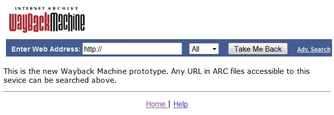
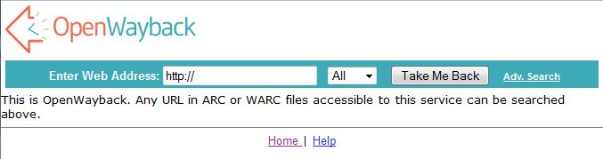
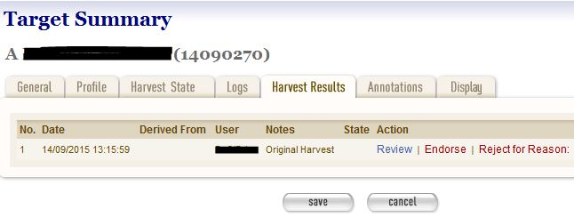
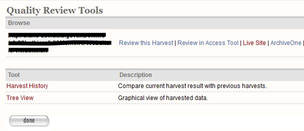

=========================
Wayback Integration Guide
=========================

Introduction
============

In order to use Wayback as an review tool within WCT, you need to deploy and configure an instance of Wayback to run
inside your Tomcat container. It is this instance of Wayback that performs the indexing.

This guide shows how to deploy and configure an instance of Wayback to run inside your Tomcat container.

Contents of this document
-------------------------

Following this introduction, the Wayback Integration Guide includes the following sections:

-   **Wayback Vs OpenWayback** - Covers the Wayback options.

-   **Installation** - Covers installing Wayback.

-   **Configuration** - Covers configuring Wayback.

-   **Wayback as a Review Tool in WCT** - Covers configuring Wayback for use as a review tool in the Web Curator Tool.

-   **Testing** - Covers testing the Wayback installation.

-   **More information** - Provides some links for more information.

Wayback vs OpenWayback
======================

Two options exist currently for Wayback: `Wayback <http://archive-access.sourceforge.net/projects/wayback/>`_ from the
Internet Archive or `OpenWayback <http://netpreserve.org/openwayback>`_ from IIPC. Web Curator Tool was originally
developed and tested with Wayback. However OpenWayback is more actively developed at the moment.

Here is an `explanation <https://github.com/iipc/openwayback/wiki/General-overview>`_ of the history and differences
between the two.

Downloading
-----------

Download Wayback `here <http://archive-access.sourceforge.net/projects/wayback/downloads.html>`_.

Download OpenWayback `here <https://github.com/iipc/openwayback/releases>`_.

Installation
============

The OpenWayback Wiki contains a useful `install guide <https://github.com/iipc/openwayback/wiki/How-to-install>`_ and
`configuration guide <https://github.com/iipc/openwayback/wiki/How-to-configure>`_. These are also relevant for Wayback.

Once you have the tool running in Tomcat and can see the homepage in your browser then you are ready to configure the
interaction with WCT.

|Wayback_home|

|OpenWayback_home|

Configuration
=============

*Please note: From here forward any reference to Wayback applies to OpenWayback and Wayback.*

The easiest configuration to get WCT and Wayback working together is to leave Wayback with its default setting of
indexing using BDB (instead of CDX). As Wayback indexes by watching a folder for new files, we need to configure WCT to
copy new harvests to a common location between the two. *Note you don't have to move where WCT is storing your harvests,
this is an extra location common to WCT and Wayback.*

In this example our common location will be `/wct/wayback/`.

-   WCT will copy our warc/arc files to `/wct/wayback/store/`, and Wayback will be watching this folder for any new files
    to index.

-   The indexes that Wayback creates will be in `/wct/wayback/index-data/merged/`.

-   Shut down Tomcat

-   Open your `wct-das.properties` file and make the following changes. (`wct-das.properties` is located in
    `/<path to tomcat>/webapps/wct-store/WEB-INF/classes/`)::

        #WaybackIndexer
        # Enable this indexer
        waybackIndexer.enabled=true
        # Frequency of checks on the merged folder (milliseconds)
        waybackIndexer.waittime=1000
        # Time to wait for the file to be indexed before giving up (milliseconds)
        waybackIndexer.timeout=300000
        # Location of the folder Wayback is watching for auto indexing
        waybackIndexer.waybackInputFolder=/wct/wayback/store
        # Location of the folder where Wayback places merged indexes
        waybackIndexer.waybackMergedFolder=/wct/wayback/index-data/merged
        # Location of the folder where Wayback places failed indexes
        waybackIndexer.waybackFailedFolder=/wct/wayback/index-data/failed

-   Open your `wayback.xml` file and change the `wayback.basedir` path. (`wayback.xml` is located in
    `/<path to tomcat>/webapps/wayback/WEB-INF/`)::

        <bean class="org.springframework.beans.factory.config.PropertyPlaceholderConfigurer">
            <property name="properties">
              <value>
                wayback.basedir=/wct/wayback
                wayback.urlprefix=http://localhost:8080/wayback/
              </value>
            </property>
        </bean>

-   Open your `BDBCollection.xml` file and change the prefix property. (`BDBCollection.xml` is located in
    `/<path to tomcat>/webapps/wayback/WEB-INF/`)::

        <bean id="datadirs" class="org.springframework.beans.factory.config.ListFactoryBean">
            <property name="sourceList">
              <list>
                <bean class="org.archive.wayback.resourcestore.resourcefile.DirectoryResourceFileSource">
                  <property name="name" value="files1" />
                  <property name="prefix" value="${wayback.basedir}/store/" />
                  <property name="recurse" value="false" />
                </bean>
              </list>
            </property>
        </bean>

Inside our common location Wayback will create the following folder structure. (`/index-data/merged/` is where the
completed indexes are stored. Their file names exactly match the name of their corresponding warc/arc file, including
the extension)::

    file-db/db
    file-db/incoming
    file-db/state
    index
    index-data/failed
    index-data/incoming
    index-data/merged
    index-data/queue
    index-data/tmp

Wayback as a Review Tool in WCT
===============================

In order to use Wayback as a review tool inside WCT, there are some more configuration changes.

First take note of the url that Wayback is running from inside Tomcat. This should match the `wayback.urlprefix`
property we saw above in `wayback.xml`. In our example it is http://localhost:8080/wayback/.

Open your `wct-core.properties` file and make the following changes. (`wct-core.properties` is located in
`/<path to tomcat>/webapps/wct/WEB-INF/classes/`)::

    harvestResourceUrlMapper.urlMap=http://localhost:8080/wayback/{$ArcHarvestResource.FileDate}/{$HarvestResource.Name}
    qualityReviewToolController.enableBrowseTool=true
    qualityReviewToolController.enableAccessTool=true
    qualityReviewToolController.archiveUrl=http://localhost:8080/wayback/*/

Testing
=======

Once you have restarted Tomcat, schedule a harvest to test the integration.

-   When the harvest is completed, you should see it's warc/arc file copied to `/wct/wayback/store`

-   When the indexing is complete, you should see the index file in `/wct/wayback/index-data/merged`

-   Inside WCT - Under the *Harvest Results* tab for a Target Instance, *Review* your completed harvest.

    |screenshot_TargetSummary_HarvestResults|

-   Choose the option to 'Review in Access Tool' to view the harvest in Wayback.

    |screenshot_TI_ReviewTools|

More information
================

The following guides can provide additional information:

-   :doc:`System Administrator Guide <system-administrator-guide>`

-   :doc:`Developer Guide <developer-guide>`

-   :doc:`Troubleshooting Guide <troubleshooting-guide>`

-   :doc:`FAQ <faq>`

